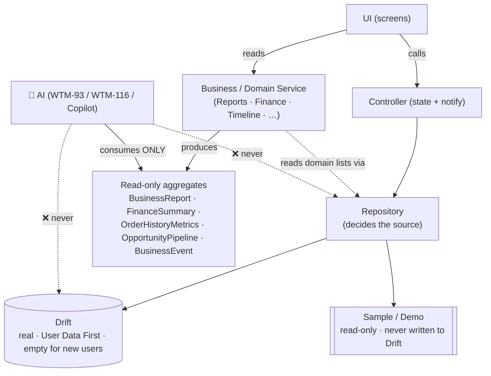

# Data Flow by Capability

**Reviewed:** 2026-07-24 · **Extends:** [DASHBOARD-DATA-FLOW.md](DASHBOARD-DATA-FLOW.md)
(WTM-117) · **Governs:** ADR-TON-008 (persistence seam), ADR-TON-002 (Riverpod).

> Mục đích: xác nhận **AI chỉ tiêu thụ Business/Domain Service** — không truy cập
> trực tiếp Repository / Store / Drift. / Confirm AI consumes only the
> Service/Domain layer, never Repository/Store/Drift directly.

## Layered architecture (target — ADR-TON-008)

- **Repository decides the source** — the UI never knows Demo / Drift / Cloud.
- **AI consumes the Service/Domain aggregate**, never Repository/Store/Drift.

## Current state per capability

| Capability | UI calls | Nguồn hiện tại | Business/Domain Service |
|---|---|---|---|
| **Finance** | Controller → **Repository** | **Drift** ✅ (real, empty) · Sample = demo | `FinanceService` → `FinanceSummary` |
| **Chat** | Controller → **Store** | **Drift** ✅ (WTM-81, local-only ADR-TON-004) | `ChatMessageStore.search`, AI context builder |
| **Producer** (favorites) | Controller → **Store** | **Drift** ✅ (favorites) | `SupplierSearchService` (search = sample) |
| **Reports** | **Service** (direct) | Sample ⏳ (`kSampleCustomerOrders`, `kSampleCustomers`) | `ReportsService` → `BusinessReport` |
| **Orders / Consumer history** | Service | Sample ⏳ | `CustomerOrderHistoryService` → `OrderHistoryMetrics` |
| **Consumer** (directory) | Controller → **Repository** | **Drift** ✅ (WTM-123, real, empty) · Sample = demo | `CustomerDirectoryService` |
| **Inventory** | Controller → **Repository** | **Drift** ✅ (WTM-121, real, empty) · Sample = demo | `ProductInventoryService`, `StockAlertService` |
| **Opportunity** | Controller | Sample ⏳ (`kSampleOpportunities`) — AI-generated, chờ WTM-93 | `opportunityPipeline`, `opportunityActionPlan` (pure) |
| **Journey** | Controller → **Repository** | **Drift** ✅ (WTM-124, real, empty) · Sample = demo | `goalActionPlan` (pure) + `BusinessGoal` getters |
| **Timeline** | **Service** ← EventSources | Sample ⏳ (sources read `kSample*`) | `TimelineService` → `BusinessEvent` |

✅ = Drift-backed (persistent) · ⏳ = still Sample/in-memory; will move to Drift on
the **same Repository seam** (P0.3 extension) — the Service interface stays stable.

## AI consumption boundary (the guarantee)

| AI capability | Reads from layer | Aggregate consumed | Must NOT read |
|---|---|---|---|
| **WTM-116 AI Summary** | `ReportsService` + `FinanceService` | `BusinessReport`, `FinanceSummary` | ❌ Drift / Repository |
| **WTM-93 Opportunity Scoring** | `opportunityPipeline` + `Opportunity` domain (+ Reports context) | `OpportunityPipeline`, scores | ❌ Drift / Repository |
| **AI Copilot context** (WTM-82, shipped) | Domain services | business-context object | ❌ Drift directly |

**Why the boundary holds across the Drift migration:** a Service takes a *domain
list* (from a Repository/Controller) and returns a **read-only aggregate**. AI
consumes that aggregate. When a module moves Sample → Drift, the Repository is
inserted **below** the Service; the Service interface (what AI reads) is
unchanged, so AI never needs edits and never learns the source.

### Enforcement rule (for WTM-93 / WTM-116 and any AI code)

> **AI code imports the Service/Domain layer only.** It must **never** import
> `*Repository`, `Drift*Store`, or `AppDatabase`. Some Services today read
> `kSample*` inline (Reports, Consumer history…); when they move to Drift, the
> Repository goes *under* the Service — AI keeps reading the Service, so no AI
> code changes and the boundary is preserved.

## Migration order (P0.3 extension, same seam)

**Persistence arc for user-authored capabilities is COMPLETE:** Finance
(WTM-120) · Inventory (WTM-121) · Consumer (WTM-123) · Journey (WTM-124) all on
the same Repository seam (ADR-TON-009). The remaining ⏳ rows are **not** simple
migrations: **Orders** has no entry form/UX (gate G-2), **Opportunity** is
AI-generated (WTM-93), **Timeline** inherits automatically once Orders persist.
**Reports/Home** read through the Services above, so they inherit real data as
each underlying module persists — but their revenue/KPIs derive from **Orders**,
so they stay Sample until Orders land (gate G-2). See OPEN-DECISIONS "Gates".
