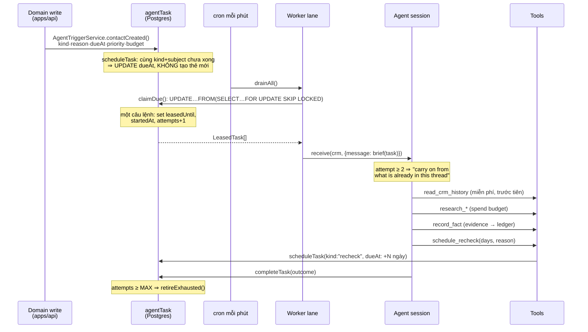

# 03 · Durable Agent — cơ chế thật

> **CURRENT — EVIDENCE.** Mọi mục trace về `SOURCE-MAP.md` §Durable Agent.

## Diagram 2 — vòng lặp durable (CURRENT · EVIDENCE)

## Câu hỏi §6 — trả lời bằng code

| Câu hỏi | Trả lời | Bằng chứng |
|---|---|---|
| Agent khởi động ở đâu? | cron mỗi phút gọi `drainAll` | `schedules/dispatch.ts:11` |
| Trigger nào tạo task? | domain write qua `AgentTriggerService` | `agent-trigger.service.ts` |
| Task persist ở đâu? | bảng `agentTask` (Postgres) | `tasks.ts` |
| Agent chết/restart còn state? | **Còn.** State là dòng DB; lease hết hạn ⇒ ai đó nhận lại | `tasks.ts:49` |
| Đóng browser có chạy tiếp? | **Có** — không liên quan browser | `schedules/dispatch.ts` |
| Worker lấy task thế nào? | `claimDue()` | `tasks.ts:27` |
| Locking? | `FOR UPDATE SKIP LOCKED` | `tasks.ts:54` |
| Retry? | `attempts+1` mỗi lần claim; `< MAX_ATTEMPTS` | `tasks.ts:50` |
| Failure? | `settle(FAILED)`; hết lượt ⇒ `retireExhausted` | `dispatch.ts:24-40` |
| Lease? | 10' mặc định · 2' visible · 30' research | `tasks.ts:23`, `dispatch.ts:17-22` |
| Recheck? | `schedule_recheck` 1–730 ngày | `tools/schedule_recheck.ts` |

## Năm điểm thiết kế đáng học

**1. Claim là MỘT câu lệnh.** `UPDATE…FROM (SELECT … FOR UPDATE SKIP LOCKED)` — không đọc-rồi-ghi, nên không có cửa sổ đua. Đây là cách làm hàng đợi trên SQL đúng chuẩn, và nó gọn.

**2. Chống trùng ở *đặt lịch*, không ở *thực thi*.** `scheduleTask()` tìm task **chưa xong** cùng `kind` + cùng subject rồi **cập nhật `dueAt`**. Nghĩa là gọi trigger 50 lần vẫn chỉ có một việc. Rẻ hơn nhiều so với chống trùng lúc chạy.

**3. Hai làn, hai lease.** Việc *nhìn thấy được* (ảnh đại diện, logo — người dùng đang chờ) lease 2 phút, concurrency 6. Việc *nghiên cứu* lease 30 phút, batch 12. Một hằng số duy nhất tách trải nghiệm khỏi throughput.

**4. Lần thử lại là *tiếp tục*, không phải *làm lại*.** `brief()` chèn câu *"This is attempt N; the earlier one did not finish. Carry on from what is already in this thread rather than starting again."* Thread của session vẫn còn ⇒ retry rẻ.

**5. `budget` đi cùng task, không đi cùng agent.** Mỗi task mang số lượt gọi vendor được tiêu. `schedule_recheck` cho phép agent **đặt budget cho lần sau** — tức agent quyết lần kiểm tới đáng đầu tư bao nhiêu.

## Điều COMP AI **không** làm

- Không có DAG, không có workflow definition. Một task = một lời nhắn cho agent, phần còn lại do model quyết.
- Không có bước "plan" lưu xuống. Kế hoạch sống trong thread của session.
- Không có phân tán. Một Postgres, nhiều worker cùng process.

⇒ Với Tổng Tài, đây là bằng chứng mạnh cho §22: **SQLite/Postgres + cron + lease là đủ.**
