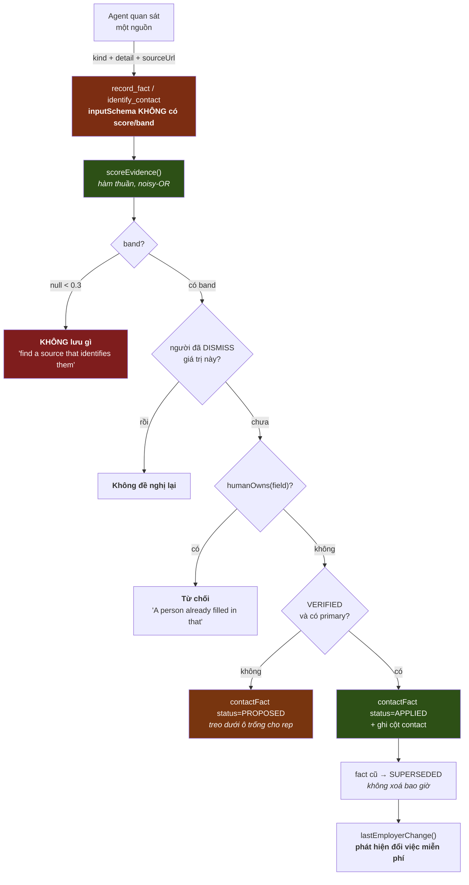

# 04 · Evidence → Business Truth

> **CURRENT — EVIDENCE.** Đây là phần P0 của Task Order và là phần đáng học nhất.

## Diagram 3 — Evidence → Fact (CURRENT · EVIDENCE)



## Cơ chế định giá

```
score = 1 − Π(1 − weight_i)      // noisy-OR: nhiều nguồn độc lập cộng dồn
score = min(score, 0.99)          // trần
nếu có `contradiction`: score = min(score, 0.45)   // KẸP, không trừ dần
```

11 loại evidence, 6 **primary** (0.7–0.95) và 5 **supporting** (0.2–0.4).

**Phân biệt primary/supporting là trục quan trọng nhất**, không phải con số. Skill định nghĩa primary là *"một nguồn định danh **chính người này**, không chỉ nhất quán với họ"*. `VERIFIED` đòi **cả** điểm ≥ 0.85 **và** có primary — nên gộp mười nguồn yếu không bao giờ ghi được vào record.

**`employer-only` nặng 0.2 và skill nói thẳng vì sao:** *"Nearly worthless on its own, and **deliberately so** — this is how a colleague gets filed as the contact."*

**`contradiction` kẹp chứ không trừ:** *"It does not lower the score a little; it holds the fact entirely… A profile saying one employer and a mail header saying another is not 60% true, it is unresolved."*

## Bốn cổng theo thứ tự (`lib/facts.ts`)

| # | Cổng | Từ chối bằng câu |
|---|---|---|
| 1 | dưới sàn | *"Below the floor for keeping — not stored."* |
| 2 | người đã DISMISS | *"A person has already dismissed this exact value. Do not offer it again."* |
| 3 | người đã điền tay | *"A person already filled in {field}. That outranks anything found on the web."* |
| 4 | chưa VERIFIED | → `PROPOSED`, kèm *"This is a normal outcome, not a failure — **do not try to raise the score**."* |

Câu ở cổng 4 đáng chép nguyên: nó chặn đúng hành vi mà mọi hệ thống chấm điểm sinh ra — model đi tìm thêm bằng chứng để đẩy qua ngưỡng. Skill nói lại lần nữa: *"Do not go looking for extra evidence to push a claim over a line — that is how a wrong answer gets dressed up as a right one."*

## Phát hiện đổi việc là **hệ quả**, không phải tính năng

Fact cũ chuyển `SUPERSEDED` + `supersededAt`, không xoá. Nhờ đó `lastEmployerChange()` chỉ là một truy vấn: SUPERSEDED gần nhất vs APPLIED hiện tại.

⇒ **Bài học chuyển giao được:** ledger append-only cho *sự kiện đời sống* miễn phí. Nếu Tổng Tài lưu ProposedChange với cùng vòng đời, thì "khách đổi số điện thoại", "sản phẩm đổi nhà cung cấp", "giá vốn thay đổi" đều không cần cơ chế riêng.

## Đối chiếu Tổng Tài

| | COMP AI | Tổng Tài hôm nay |
|---|---|---|
| Ai định confidence | **hàm thuần** từ evidence kind | **chỗ gọi khai** (`IdentityCandidate.confidence`) |
| Vòng đời thay đổi do AI | PROPOSED·APPLIED·SUPERSEDED·DISMISSED | **không có** |
| Người thắng máy | `humanOwns()` — một cổng | có nguyên tắc, cài **rải rác** (FK 787 · `outranksAutomation`) |
| Nguồn gốc | `evidence[]` + `method` + `sourceUrl` lưu cùng fact | `Provenance` (4 mã) — nói *từ đâu*, không nói *vì sao tin* |

`Provenance` của ta và `evidence[]` của họ **không thay thế nhau**: `Provenance` trả lời *"bản ghi này ai tạo"*, `evidence` trả lời *"vì sao tin nó đúng"*. Tổng Tài đang có cái đầu, thiếu cái sau.

## Về Dismissed — Founder đã chỉ đạo nới (2026-08-08)

COMP AI cấm **vĩnh viễn**: DISMISS một giá trị là không bao giờ đề nghị lại. Điều đó đúng cho CRM (tên một người không đổi), **không** đúng cho mọi miền của Tổng Tài: giá nhà cung cấp, mức tồn kho, dự báo cầu đều **nên** được đề nghị lại khi có dữ liệu mới.

⇒ Khuyến nghị (xem `20-RECOMMENDATIONS.md` R-3): `DISMISSED` mang thêm **điều kiện xét lại** — `reconsiderAfter` (thời hạn) hoặc `reconsiderOnNewEvidenceKind` (bằng chứng thuộc loại mạnh hơn). Mặc định theo miền, **không** một luật chung.
