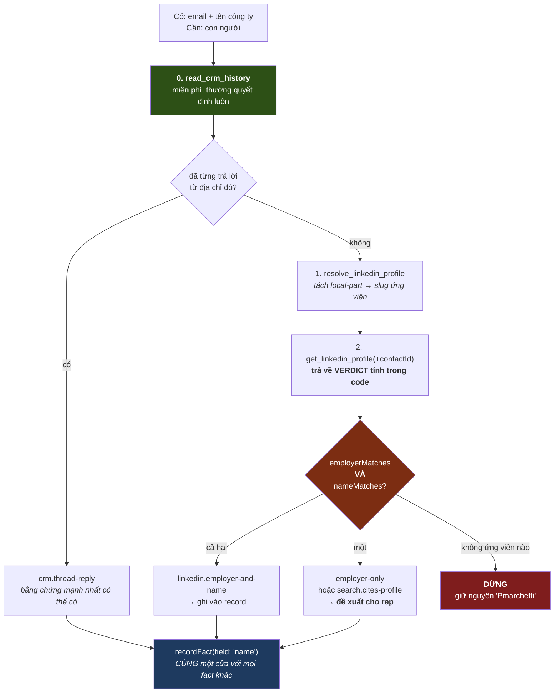

# 05 · Identity Resolution

> **CURRENT — EVIDENCE.**

## Diagram 4 — khớp danh tính (CURRENT · EVIDENCE)

## Ba điều đáng học

**1. Không có hệ con identity.** `identify_contact` gọi thẳng `recordFact({field: "name"})`. Danh tính chỉ là **một fact**, chịu đúng bốn cổng và đúng ledger. Không đường tắt, không bảng riêng, không luật riêng.

**2. Đoán ở *chỗ tìm*, không đoán ở *câu trả lời*.**

> *"`pmarchetti@fernhill.com` is not a name. Asking a model what it stands for produces 'Paula Marchetti' — which happens to be right, and **would have been just as confident had it been wrong**."*

Giải pháp: tách `pmarchetti` → họ `marchetti`, tìm *cái đó* cùng tên công ty, và **câu trả lời đến từ profile**. Suy đoán đi vào **truy vấn**, không vào kết luận.

⇒ Đây là một luật tổng quát hơn cả identity: *guess where to look, never what you will find.*

**3. Verdict tính trong code, model chỉ đọc.** `get_linkedin_profile` trả về `employerMatches`/`nameMatches` đã tính sẵn, và skill dặn **"Read the verdict, not the profile"**. Cùng nguyên tắc với evidence: model báo cái nó thấy, code kết luận.

## "Both, or it is not them"

> *"One of the two is not a weaker match, it is **a different person who happens to share something**."*

**Tổng Tài đã tự rút ra đúng luật này ở WTM-291** — `strong` (trùng số điện thoại) chỉ được đề xuất, không được tự liên kết, vì hai người thật có thể dùng chung một số. Hai hệ độc lập, cùng kết luận, cùng lý do. Đó là tín hiệu mạnh rằng luật đúng.

## Bốn thứ "trông như bằng chứng mà không phải"

Skill liệt kê, và mỗi cái có một ví dụ thật:

| Không phải bằng chứng | Vì sao |
|---|---|
| Kết quả tìm kiếm | *"Search says where to look."* Một truy vấn "Paula Marchetti" từng trả về CEO Brightwater, HR lead ở Reply, và một data engineer ở Seattle — **cả ba với sự tự tin tuyệt đối** |
| Trùng tên riêng | *"Half the Chrises at a company are not your Chris"* |
| Quan điểm của Perplexity về chức danh | nó tổng hợp nguồn cũ — báo "Account Executive L3" cho profile ghi "Growth Specialist" |
| Một cách bung tên rất hợp lý | *"`jsmith` is probably J. Smith. **Probably is not a source.**"* |

## Đối chiếu WTM-291

| | COMP AI | Tổng Tài WTM-291 |
|---|---|---|
| Không tự gộp bản ghi người | ✅ (không có API gộp) | ✅ **khoá bằng 3 lớp governance** |
| Mức cao nhất mới tự động | ✅ VERIFIED + primary | ✅ chỉ `exact` |
| Mức giữa ⇒ đề xuất | ✅ `PROPOSED` | ⚠️ `SuggestLink` **trả về**, nhưng không có nơi lưu |
| Confidence do ai định | **hàm thuần** | ❌ **chỗ gọi khai** |
| Lịch sử liên kết | evidence lưu trong fact | ✅ `identity_link_events` |
| Gỡ hàng loạt khi luật sai | — | ✅ `actor = rule:<tên>` |

**Hai chỗ Tổng Tài đang MẠNH HƠN:** governance test khoá luật "không tự gộp" bằng cấu trúc (COMP AI chỉ có sự vắng mặt của API), và `IdentityLinkEvent.actor` cho phép gỡ hàng loạt khi một luật khớp hoá ra sai — COMP AI không có tương đương.

**Một chỗ Tổng Tài đang YẾU HƠN:** `SuggestLink` là giá trị trả về trong bộ nhớ, không có bảng. Đề xuất không sống sót qua một lần đóng app.
