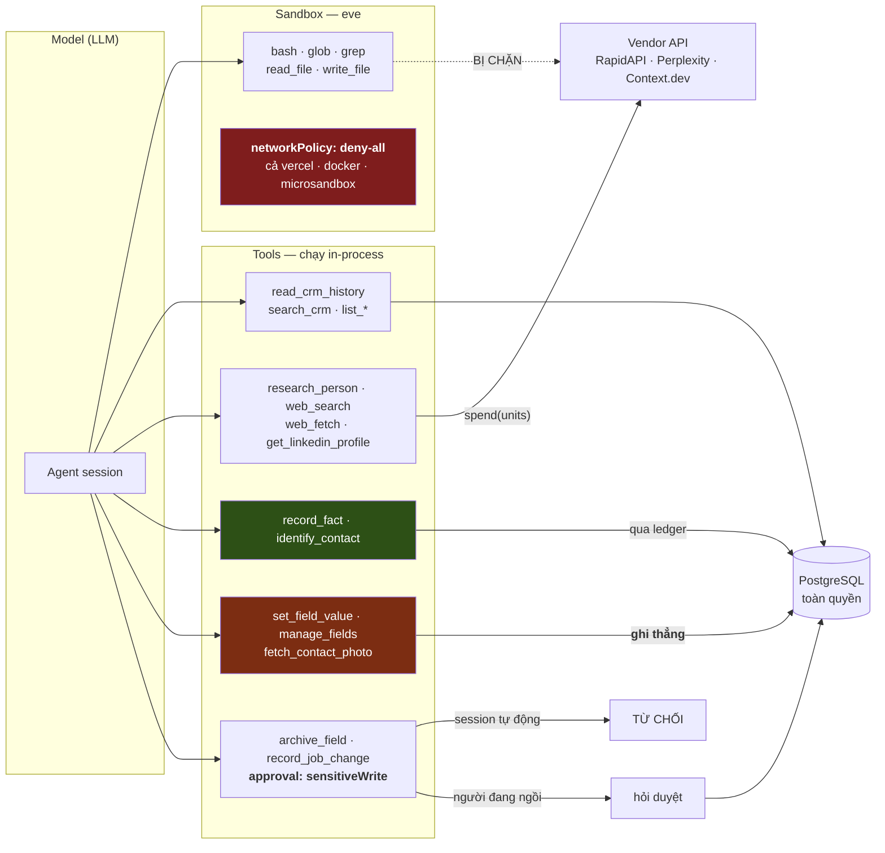

# 06 · Tool boundary và Sandbox

> **CURRENT — EVIDENCE.**

## Diagram 5 — ranh giới tool/mạng/DB (CURRENT · EVIDENCE)

## Trả lời §9 bằng code

| Câu hỏi | Trả lời |
|---|---|
| Agent có truy cập DB trực tiếp? | **Không qua model.** Tools chạy in-process với `import { db }` — toàn quyền. Model chỉ gọi được tool. |
| Agent có truy cập mạng trực tiếp? | **Không trong sandbox** — `networkPolicy: "deny-all"` cả 3 backend. Mạng chỉ qua tool có tên. |
| Sandbox bảo vệ gì? | Chặn **egress tuỳ ý** từ code model tự viết. Nó không bảo vệ DB — DB không nằm trong sandbox. |
| Secret đi qua đâu? | `sandboxPolicy.credentials: "app-runtime-only"` — key sống ở runtime, không vào sandbox. |
| Tool permission enforce thế nào? | Bằng **tập tool nạp vào session** + `assertResearchPurpose(ctx)` trong từng tool + `approval` cho 2 tool. |

## Phân nhóm 42 tool

| Nhóm | Tool | Ghi DB | Mạng | Duyệt |
|---|---|:--:|:--:|:--:|
| **READ** | `read_crm_history` · `read_company_history` · `read_deal_history` · `search_crm` · `query_crm` · `list_deals` · `list_fields` · `list_outstanding_work` · `inspect_run` | – | – | – |
| **RESEARCH** | `research_person` · `research_company` · `web_search` · `web_fetch` · `get_linkedin_profile` · `resolve_linkedin_profile` · `find_contact_socials` · `get_contact_work_history` | – | ✅ | – |
| **WRITE qua ledger** | `record_fact` · `identify_contact` · `write_brief` | ✅ | – | – |
| **WRITE thẳng** | `set_field_value` · `manage_fields` · `set_contact_socials` · `fetch_contact_photo` · `enrich_company` · `write_workspace_profile` | ✅ | – | – |
| **WRITE có duyệt** | `archive_field` · `record_job_change` | ✅ | – | ✅ |
| **SCHEDULE** | `schedule_recheck` | ✅ | – | – |
| **ACTION** | `create_crm_activity` *(qua `agentAction`)* | ✅ | – | – |
| **SANDBOX** | `bash` · `glob` · `grep` · `read_file` · `write_file` · `todo` · `ask_question` · `finish_run` | – | ❌ | – |

**Nhóm "WRITE thẳng" là lỗ hổng** — 6 tool ghi vào DB không evidence, không lifecycle, không idempotency. Xem `12-CANONICAL-ACTION-MODEL.md`.

## Ranh giới dữ liệu: **egress**, không phải read

`skills/data-boundaries.md` đảo ngược trực giác thường gặp:

> *"You may read everything. This is a single-tenant internal CRM… There is no redaction to work around and no approval to seek."*

Và giải thích **vì sao đó là lợi thế**:

> *"A signature block settles a job title more reliably than LinkedIn does, because people update a signature the week they are promoted."*

Ba luật, tất cả về **cái rời đi**:
1. Không dán nội dung khách vào truy vấn bên thứ ba — hỏi **câu dẫn xuất** (*"Acme công bố gì năm 2026?"*), không dán thread
2. Không đưa nội dung hộp thư vào `/workspace` (sandbox có vòng đời và khán giả khác)
3. Không log thứ nhạy cảm

Cộng một luật nội dung: **chỉ dữ liệu công việc**. Không danh mục đặc biệt (sức khoẻ, chính trị, tôn giáo, xu hướng tính dục, sắc tộc, công đoàn) *"regardless of what a source volunteers"*.

> *"A CRM that knows a customer's marathon time is a CRM somebody has to explain."*

## Không có gì chặn ghi thẳng

`apps/agent/test/` có **24 file**, không file nào là boundary/architecture test. `biome.jsonc` không có `no-restricted-imports`. CI không kiểm ranh giới.

⇒ Ba kỷ luật ghi cùng tồn tại **vì không có gì bắt chúng hợp nhất**. Đây là bằng chứng phản chứng mạnh nhất trong toàn bộ nghiên cứu, và nó nói thẳng cho Tổng Tài: cửa ghi duy nhất **phải được khoá bằng cấu trúc**, không bằng quy ước.
