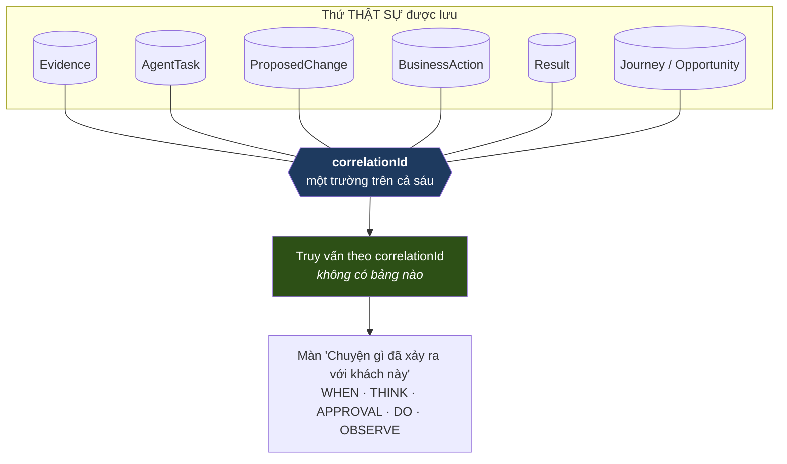

# 10 · Business Conversation Model

> **Kết luận: KHÔNG tạo entity mới.** Founder đã chấp nhận 2026-08-08.

## Câu hỏi

Founder Vision nói mọi tín hiệu đi qua Tổng Tài đều là một *"Business Conversation"* tiềm năng với AI — và conversation **không chỉ là chat text**. Vậy có cần một entity `BusinessConversation` không?

## Bằng chứng từ source: COMP AI **không** có, và không cần

`agentConversation` tồn tại nhưng đọc cột thì rõ nó là **chat thread thật**:

```
sessionId · continuationToken · streamIndex · title · messageCount · lastMessageAt
```

Đó là hội thoại người–agent, không phải trừu tượng nghiệp vụ.

"Câu chuyện của một bản ghi" được **dựng lúc đọc**: `readCrmHistory()` join `contact` + `emailThread`/`emailMessage` + `calendarEvent` + `deal` + đồng nghiệp — tại chỗ, không lưu.

Và `activity` là timeline hợp nhất (`NOTE·CALL·EMAIL·MEETING·TASK·STAGE_CHANGE·ENRICHMENT`), người và agent cùng ghi vào, với **con trỏ ngược**:

```js
meta: { source: "agent", agentId, runId, actionId }
```

⇒ Thứ làm cho câu chuyện ráp lại được **không phải một bảng, mà là một khoá**.

## Diagram 7 — Business Conversation như PROJECTION (PROPOSAL)

> ⚠️ **PROPOSAL** — chưa cài đặt. Không trộn với CURRENT.



Ví dụ "Win-back khách VIP" — **không có bảng conversation nào**, chỉ một `correlationId`:

| Bước | Bản ghi thật | Người bán thấy |
|---|---|---|
| Khách ngủ đông 45 ngày | `Evidence` | *"Chị Hoa 45 ngày chưa mua"* |
| Agent phân tích | `AgentTask` | *"Đang xem lịch sử mua"* |
| Đề nghị ưu đãi | `ProposedChange` | *"Gợi ý: giảm 10% cho nồi chiên"* |
| Người bấm duyệt | `ProposedChange.status = APPLIED` | ✓ |
| Gửi tin | `BusinessAction` | *"Đã gửi qua Telegram"* |
| Khách mua | `Result` + `Evidence` mới | *"Chị Hoa đã quay lại — đơn 1,89tr"* |

## Vì sao entity riêng là hướng sai

**1. Nó sẽ là bản sao thứ hai.** Mọi trường của nó đã có ở nơi khác ⇒ lỗi P-27/P-28 đã lặp bốn lần trong repo này.

**2. Ranh giới một "cuộc hội thoại" không xác định.** Khách quay lại rồi 60 ngày sau lại ngủ đông — cùng một hội thoại hay hai? Không có câu trả lời đúng, nghĩa là câu hỏi sai. `correlationId` để chỗ gọi quyết, và sai thì sửa một trường.

**3. Nó phải được ai đó đóng.** Một bảng có `status` cần luật đóng. Projection thì không — nó là cái đang có, đọc lúc nào cũng đúng.

**4. COMP AI chạy thật không cần nó.**

## Điều projection **không** cho miễn phí

Phải nói thẳng chỗ yếu:

| Thiếu | Cách bù |
|---|---|
| Không có "tiêu đề cuộc hội thoại" | sinh lúc đọc từ `AgentTask.reason` — COMP AI làm đúng vậy (`conversation-title.ts`) |
| Truy vấn tốn hơn một `SELECT` | index trên `correlationId`; SQLite thừa sức ở quy mô một người bán |
| Không có nơi treo phản hồi của người | treo lên `ProposedChange` — nó đã có vòng đời |

## Khuyến nghị

**Thêm `correlationId TEXT` (nullable) vào `Evidence`, `AgentTask`, `ProposedChange`, `BusinessAction`, `Result`.** Một trường, index, không bảng mới, không migration phá huỷ.

Nullable vì bản ghi đứng một mình vẫn hợp lệ — không phải việc gì cũng thuộc một chuỗi.
