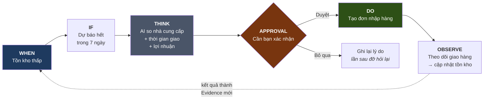

# 14 · Orchestration UX

> **PROPOSAL.** Không code, không lộ n8n/webhook/JSON.

## COMP AI: từ vựng trigger chỉ có **bốn**

```
AgentTriggerType = MANUAL | SCHEDULE | EVENT | WEBHOOK
```

Và agent được **tạo bằng cách nói chuyện với một agent khác** (`subagents/agent_builder` có `ask_question`), rồi bản nháp đi qua **version → approve → deploy** (`agentVersion.status`, `approvedAt`, `deployedAt`).

Không canvas, không node, không kéo thả.

⚠️ Với Tổng Tài, `WEBHOOK` là loại **duy nhất phải giấu hẳn** — §16 cấm lộ webhook.

## Diagram 8 — Business Orchestration (PROPOSAL)



## Nguyên tắc: **cấu hình mang theo lời giải thích**

Đây là thứ mượn thẳng từ COMP AI (`scopeSummary()`, `sandboxPolicy.summary`) và nó giải quyết đúng bài toán UX: người bán không đọc JSON, nhưng cũng không nên phải đọc một bản dịch **rời** khỏi cấu hình — bản dịch rời sẽ lệch.

⇒ Mỗi `AutonomyRule` và mỗi `BusinessAction` **lưu kèm câu tiếng Việt của chính nó**, sinh lúc tạo. Màn hình chỉ việc hiện `summary`.

## MVP đề xuất: **Automation Card**

Năm hướng §16 nêu (Cards · Business Flow · Journey-linked · AI-generated · Templates). Đề xuất **A · Automation Cards** cho MVP, vì:

- một thẻ = một `AutonomyRule` = một dòng dữ liệu. Không cần trình dựng đồ thị.
- hợp màn hình điện thoại. Business Flow cần màn rộng.
- người bán SME nghĩ theo *việc*, không theo *luồng*.

```
┌─────────────────────────────────────┐
│ 🔔 Nhắc nhập hàng                   │
│                                     │
│ KHI   tồn kho dưới mức cảnh báo     │
│ NẾU   dự báo hết trong 7 ngày       │
│ THÌ   Tổng Tài soạn đơn nhập hàng   │
│                                     │
│ [ Hỏi tôi trước ▾ ]                 │
│   • Chỉ báo cho tôi biết            │
│   • Hỏi tôi trước       ✓           │
│   • Tự làm, tối đa 5tr/lần          │
│                                     │
│ Lần gần nhất: 3 ngày trước ·        │
│ bạn đã duyệt 2, bỏ qua 1            │
└─────────────────────────────────────┘
```

Ba chi tiết có chủ đích:

**1. Dropdown ba mức, không phải công tắc bật/tắt.** Ba mức = `SUGGEST` / `CONFIRM` / `AUTO`. Người bán chọn mức tin tưởng, không chọn "AI on/off".

**2. Giới hạn hiện ngay trong lựa chọn** (*"tối đa 5tr/lần"*) — không giấu trong màn cài đặt khác. Nếu giới hạn không nhìn thấy lúc bật thì nó không phải giới hạn.

**3. Dòng cuối là lịch sử thật.** *"Bạn đã duyệt 2, bỏ qua 1"* đọc từ `ProposedChange.status` — nó cho người bán biết thẻ này có đáng tin không, bằng chính hành vi của họ.

## Màn thứ hai: "Chuyện gì đã xảy ra"

Đây là projection ở `10-BUSINESS-CONVERSATION-MODEL.md`, hiện theo `correlationId`:

```
Chị Hoa · khách VIP
───────────────────────────────
🕐 45 ngày chưa mua          (Evidence)
🤔 Tổng Tài xem lịch sử mua   (AgentTask)
💡 Gợi ý giảm 10% nồi chiên   (ProposedChange)
✓  Bạn đã duyệt · 14:32
📤 Đã gửi qua Telegram        (BusinessAction)
🎉 Chị Hoa quay lại · 1,89tr  (Result)
```

Mỗi dòng là một bản ghi thật, không phải log. Bấm vào là thấy bằng chứng.

## ⛔ Không bao giờ lộ

webhook URL · node · JSON · OAuth internals · retry queue · workflow n8n · `idempotencyKey` · tên vendor API.

**Ngoại lệ có chủ đích:** khi một hành động **thất bại**, người bán phải thấy *cái gì hỏng bằng ngôn ngữ của họ* (*"Telegram từ chối — có thể khách đã chặn"*), không phải mã lỗi. Đó là `BusinessAction.errorCode` được dịch, không phải `errorMessage` thô.
