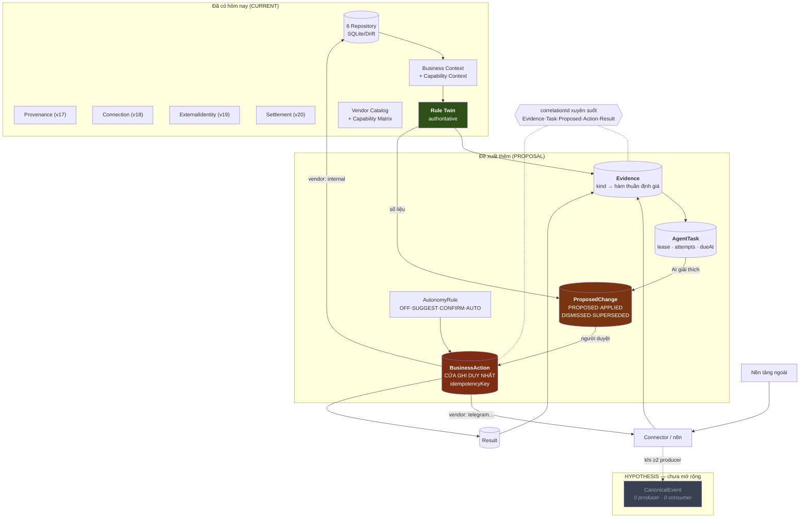

# 17 · Target Architecture cho Tổng Tài

> ⚠️ **PROPOSAL — chưa được duyệt, chưa cài đặt.** Không trộn với CURRENT.
> Founder + GPT phản biện trước khi mở implementation story.

## Diagram 6 — Target Agentic Architecture (PROPOSAL)



## Khác gì so với candidate ban đầu của Founder

Candidate:
```
External Signal → Canonical Event → Evidence → Agent Task
  → Proposed Change / Business Action → Approval/Policy → Connector/n8n → Result/Evidence
```

Ba sửa, mỗi sửa có bằng chứng:

| # | Sửa | Vì sao |
|---|---|---|
| 1 | **Canonical Event thành nhánh đứt** | 0 producer/consumer. COMP AI chạy production không có tầng này. Giữ hypothesis. |
| 2 | **BusinessAction phủ cả `vendor: internal`** | đúng chỗ COMP AI hụt — `set_field_value` ghi DB của chính nó nên không ai nghĩ nó cần đi qua action |
| 3 | **Rule Twin nuôi cả Evidence lẫn ProposedChange** | ADR-TON-016 không đổi: Rule Twin vẫn authoritative về **số**, agent chỉ giải thích và đề nghị |

## Bốn thứ thêm vào, không hơn

| Thứ | Loại | Vì sao cần |
|---|---|---|
| `Evidence` | entity | không có nó thì confidence lại do chỗ gọi khai |
| `AgentTask` | entity | không có nó thì không có gì tiếp tục sau khi đóng app |
| `ProposedChange` | entity | không có nó thì không lên được L2 |
| `BusinessAction` | entity | cửa ghi duy nhất |
| `AutonomyRule` | entity nhỏ | 4 trường |
| `correlationId` | **một trường** | projection thay cho BusinessConversation |

**Không** runtime mới · **không** BusinessConversation · **không** memory store · **không** bus.

## ⚠️ Vấn đề chưa giải: durable agent trên local-first

Đây là **khoảng cách lớn nhất** giữa COMP AI và Tổng Tài, và nghiên cứu này **không giải được**.

COMP AI có server luôn thức + cron mỗi phút. Tổng Tài **cố ý không có backend** cho dữ liệu nghiệp vụ (D-5), và điện thoại không chạy nền tuỳ ý.

Ba hướng, chưa hướng nào được chọn:

| Hướng | Được | Mất |
|---|---|---|
| **A · Task chạy khi mở app** | không backend, không đổi doctrine | không có gì xảy ra khi app đóng — "durable" chỉ còn nghĩa "không mất việc" |
| **B · WorkManager (Android)** | chạy nền thật, vẫn on-device | iOS hạn chế hơn nhiều; pin; BYOK key phải đọc được lúc nền |
| **C · Optional Integration Runtime** | agent chạy thật 24/7 | **chạm doctrine backend** — dù Founder đã gỡ ở *cấp connector* (2026-08-02), agent là chuyện khác |

**Khuyến nghị: bắt đầu bằng A.** `AgentTask` với `dueAt` + `attempts` + `leasedUntil` **có giá trị ngay cả khi chỉ chạy lúc mở app** — nó biến "AI trả lời một câu hỏi" thành "AI tiếp tục việc dở". Chọn B/C là **Founder Gate**, xem `21-FOUNDER-DECISIONS.md` D-4.

## Điều KHÔNG đổi

| | |
|---|---|
| **Rule Twin authoritative** (ADR-TON-016) | agent đề nghị và giải thích, **không** thay Rule Twin tính số |
| **Local-first** (D-5) | Evidence/Task/Proposed/Action đều nằm trên máy |
| **Không tự gộp khách** (ADR-TON-024 luật 4) | 3 lớp governance giữ nguyên |
| **AI chỉ hứa ở `verifiedOnDogfood`** (luật 3) | `CapabilityClaim` giữ nguyên |
| **BYOK / privacy** (G-3) | không đổi |
