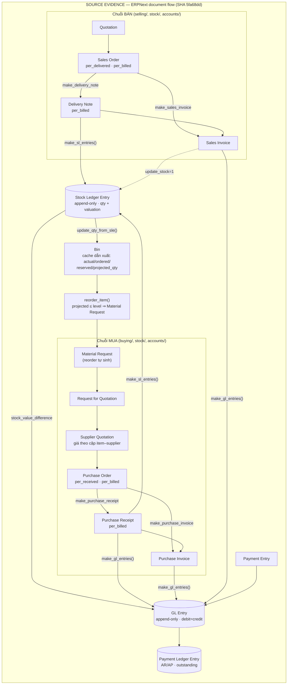

# 02 · ERPNext Domain Study — tri thức domain ERP/Commerce từ source thật

> WTM-449 (Epic WTM-447) · 2026-08-25 · nguồn: `~/projects/_reference/erpnext/` tại
> studied SHA `5fa68dd06835f77a60ccefa033d7955d83294d3b` (branch `develop`).
> **GPL-3.0 ⇒ LEARN ARCHITECTURE / DO NOT COPY CODE** — mọi trích dẫn dưới đây là
> evidence để học *khái niệm và invariant*, không phải mẫu để chép.
>
> Mỗi kết luận neo theo **FILE → SYMBOL → CALL PATH → CONCLUSION**. Đường dẫn viết
> tắt `erpnext/` = `~/projects/_reference/erpnext/erpnext/`. Vùng nào chưa trace
> sâu được đánh dấu `⚠️ chưa trace sâu` thay vì viết như đã đọc.

## 0. Bức tranh lớn: mọi chứng từ là một Document có docstatus, mọi sự thật là một ledger

ERPNext không phải một đống bảng — nó là **hai tầng**:

1. **Tầng chứng từ (document)**: Purchase Order, Sales Invoice… đều là DocType của
   Frappe với vòng đời `docstatus` **0 = Draft → 1 = Submitted → 2 = Cancelled**;
   sửa một chứng từ đã submit = **amend** (tạo bản mới mang `amended_from`, bản cũ
   thành Cancelled). Evidence: `erpnext/controllers/status_updater.py` →
   `StatusUpdater.set_status()` — bản ghi mới có `amended_from` bị ép về status
   `"Draft"`, và mọi status map đều có dòng `["Cancelled", "eval:self.docstatus==2"]`.
2. **Tầng sổ cái (ledger)**: khi chứng từ submit, nó **đổ bút toán** vào hai sổ
   append-only — **Stock Ledger Entry** (kho) và **GL Entry** (tiền). Chứng từ có
   thể cancel; **bút toán thì không bao giờ sửa đè** — cancel sinh bút toán đảo.

Toàn bộ controller xếp thành một chuỗi kế thừa duy nhất (evidence — dòng khai báo
class thật):

```
Document (frappe)
 └─ StatusUpdater            erpnext/controllers/status_updater.py:182
     └─ TransactionBase      erpnext/utilities/transaction_base.py:20
         └─ AccountsController   erpnext/controllers/accounts_controller.py:77
             └─ StockController  erpnext/controllers/stock_controller.py:40
                 ├─ SellingController  erpnext/controllers/selling_controller.py:19
                 │    ├─ SalesOrder · DeliveryNote · SalesInvoice
                 └─ SubcontractingController  erpnext/controllers/subcontracting_controller.py:27
                      └─ BuyingController  erpnext/controllers/buying_controller.py:33
                           ├─ PurchaseOrder · PurchaseReceipt · SupplierQuotation
```

**CONCLUSION:** một chứng từ càng "nặng nghiệp vụ" càng đứng thấp trong chuỗi và
được *thừa hưởng* các invariant của tầng trên: StatusUpdater cho per_billed/
per_received, AccountsController cho GL, StockController cho SLE. Đây là cách
ERPNext bảo đảm "mọi chứng từ đổ về GL" mà không chép logic — một bài học cấu
trúc, không phải một API để bắt chước.

## 1. Domain map — dòng chứng từ mua + bán đổ về hai sổ cái



Hai mũi tên quan trọng nhất nằm ở giữa: **SLE → GL** (giá trị kho đổ sang kế
toán qua `stock_value_difference`) và **GL → PLE** (công nợ dẫn xuất từ GL).
Không có đường nào đi ngược.

## 2. Procurement — Supplier → RFQ → Supplier Quotation → PO → PR → PI

### 2.1 Supplier

- FILE `erpnext/buying/doctype/supplier/supplier.json` → các field đáng chú ý
  (fieldname thật): `supplier_group`, `default_price_list`, `payment_terms`,
  `on_hold` + `hold_type` + `release_date` (chặn giao dịch có thời hạn),
  `prevent_rfqs`/`prevent_pos` (cảnh cáo chất lượng), `is_internal_supplier`,
  và **hai công tắc nhượng bộ SME**:
  `allow_purchase_invoice_creation_without_purchase_order`,
  `allow_purchase_invoice_creation_without_purchase_receipt`.
- CALL PATH: `AccountsController.ensure_supplier_is_not_blocked()`
  (`erpnext/controllers/accounts_controller.py:153`) chạy trong `validate()` của
  *mọi* chứng từ mua — trạng thái on-hold của Supplier là invariant tầng
  controller, không phải if rải trong từng form.
- **CONCLUSION:** ngay trong một ERP đầy đủ, chuỗi PO→PR→PI **không bắt buộc** —
  nó được nới lỏng *per-supplier, có chủ đích, có tên field*. Bài học cho SME VN:
  chuỗi chứng từ đầy đủ là *tuỳ chọn kiểm soát*, không phải điều kiện tồn tại.

### 2.2 RFQ → Supplier Quotation

- FILE `erpnext/buying/doctype/supplier_quotation/supplier_quotation.py:16` →
  `class SupplierQuotation(BuyingController)` — báo giá là **chứng từ có
  docstatus**, hết hạn qua `set_expired_status()` (dòng 245); hàm
  `get_purchased_items(supplier_quotation)` (dòng 260) cho biết món nào trong
  báo giá đã thành PO. Giá nằm ở child table item — tức **giá theo cặp
  (item, supplier), có ngày hiệu lực**, không phải một cột giá trên Supplier.
- ⚠️ chưa trace sâu: hàm map RFQ → SQ cụ thể (nằm phía RFQ/portal).

### 2.3 Purchase Order và cặp per_received / per_billed

- FILE `erpnext/buying/doctype/purchase_order/purchase_order.py:33` →
  `class PurchaseOrder(BuyingController)`.
- FILE `erpnext/controllers/status_updater.py:69-92` → `status_map["Purchase Order"]`
  — status là **hàm thuần của per_received/per_billed/docstatus**, đọc nguyên văn:
  - `To Receive and Bill`: `per_received < 100 and per_billed < 100 and docstatus == 1`
  - `To Bill`: `per_received >= 100 and per_billed < 100`
  - `To Receive`: `per_received < 100 and per_billed == 100`
  - `Completed`: `per_received >= 100 and per_billed == 100`
  - cùng `Draft`/`Cancelled`/`On Hold`/`Closed`.
- CALL PATH cập nhật phần trăm — chỗ đáng học nhất của cả chuỗi mua:
  `PurchaseReceipt.on_submit()` → `update_prevdoc_status()`
  (`StatusUpdater.update_prevdoc_status`, status_updater.py:194) → `update_qty()`
  (dòng 534) → `_update_children()` (dòng 551): giá trị `received_qty` trên dòng
  PO được **tính lại bằng `SELECT COALESCE(SUM(source_field),0) ... WHERE
  docstatus=1`** trên mọi Purchase Receipt Item đã submit trỏ về dòng PO đó —
  rồi `_update_percent_field()` (dòng 659) + `_calculate_target_parent_percentage()`
  (dòng 607) tính `per_received` = Σ min(đã nhận, đã đặt) / Σ đã đặt, và
  `_determine_status()` (dòng 634) đặt ngưỡng `>= 99.999999` = "Fully".
- `validate_qty()` (dòng 266) + `check_overflow_with_allowance()` chặn
  over-receipt/over-billing, có ngưỡng nới lỏng cấu hình được
  (`OverAllowanceError`).
- **CONCLUSION:** per_received/per_billed **không bao giờ được cộng dồn** — mỗi
  lần submit/cancel một chứng từ con, con số được **derive lại từ đầu bằng SQL
  SUM trên tập chứng từ đã submit**. Cộng dồn tăng dần là chỗ mọi hệ tự chế sai
  (miss một đường cancel là lệch vĩnh viễn); ERPNext né cả họ lỗi đó bằng cấu
  trúc. Đây chính là "anti-cộng-dồn-giả" mà Tổng Tài đã tự rút ra ở Epic WTM-297,
  được xác nhận bởi 15 năm sản xuất.

### 2.4 Purchase Receipt → ba bên khớp sổ (3-way match)

- FILE `erpnext/stock/doctype/purchase_receipt/purchase_receipt.py:25` →
  `class PurchaseReceipt(BuyingController)`; GL của nó compose ở
  `erpnext/stock/doctype/purchase_receipt/services/gl_composer.py` →
  `make_stock_received_but_not_billed_entry()` (dòng 75) dùng tài khoản
  `stock_received_but_not_billed` của Company.
- CALL PATH: PR submit ⇒ *nợ* kho (giá trị hàng vào), *có* *Stock Received But
  Not Billed* (tài khoản trung chuyển). PI submit ⇒ xoá trung chuyển, ghi *có*
  Creditors. Hàng và hoá đơn vì thế **không bao giờ đếm trùng** dù đến lệch thời
  gian, lệch số lượng, lệch giá.
- **CONCLUSION:** "nhận hàng" và "nhận nghĩa vụ trả tiền" là **hai sự kiện khác
  nhau về thời gian và giá trị**; tài khoản trung chuyển là cách ERP nói điều đó
  bằng bút toán. SME VN nhập hàng Trung Quốc (tiền trước – hàng sau, hoặc ngược
  lại) sống đúng trong khoảng lệch này.

## 3. Item — template/variant, UOM, Price List

### 3.1 Item và Item Variant

- FILE `erpnext/stock/doctype/item/item.json` → core: `is_stock_item`,
  `stock_uom`, `valuation_method`, `has_variants`, `variant_of`,
  `variant_based_on`, `has_batch_no`/`has_serial_no`, `barcodes` (child table),
  `brand`, `item_group` (tree), `end_of_life`, `lead_time_days`.
- FILE `erpnext/controllers/item_variant.py` — cơ chế variant đầy đủ:
  - `create_variant()` (dòng 320): variant là **một Item row đầy đủ** với
    `variant_of` trỏ về template và child table `attributes`
    (Item Variant Attribute: `attribute` + `attribute_value`).
  - `copy_attributes_to_variant()` (dòng 448): copy field từ template sang
    variant theo **allowlist cấu hình được** (DocType `Variant Field`) + mọi
    field `reqd`; exclude cứng `item_code`, `valuation_rate`, `opening_stock`…
  - `make_variant_item_code()` (dòng 500): SKU variant = `TEMPLATE-ABBR1-ABBR2`
    sinh từ **abbr của Item Attribute Value** — SKU dẫn xuất từ thuộc tính, không
    tự do.
  - `find_variant()` (dòng 297): tìm variant theo **tập thuộc tính đúng bằng** —
    tổ hợp thuộc tính là *danh tính* của variant, hai variant không được trùng tổ
    hợp.
  - `validate_item_variant_attributes()` (dòng 90) + `validate_is_incremental()`
    (dòng 112): giá trị phải nằm trong Item Attribute master; thuộc tính **số**
    có `from_range/to_range/increment` — "size 41.5" hợp lệ hay không là luật
    của attribute, không phải chuỗi tự do.
  - `class ItemTemplateCannotHaveStock` (dòng 24): **template không bao giờ có
    tồn kho** — chỉ variant giao dịch được. `reorder_item.py:79` cũng `continue`
    khi `has_variants`.
- **CONCLUSION:** ERPNext trả lời câu "typed vs dynamic" như sau: mọi field
  *giao dịch được* (giá, kho, UOM, thuế) là **typed column trên Item**; phần
  *mô tả tổ hợp* (màu, size) là **attribute có master + validation**, và variant
  vật chất hoá thành Item đầy đủ để tầng kho/kế toán không cần biết khái niệm
  variant tồn tại. Chi phí: nổ số lượng Item (họ phải chặn `>= 600` tổ hợp mỗi
  lần tạo — `enqueue_multiple_variant_creation`, dòng 358).

### 3.2 UOM conversion

- FILE `erpnext/stock/doctype/item/item.json` → child table `uoms`
  (UOM Conversion Detail); mọi SLE ghi bằng `stock_uom`; chứng từ mua/bán được
  ghi bằng UOM khác kèm `conversion_factor`. `reorder_item.py:245-260` cho thấy
  cả đường tự động cũng quy đổi (`purchase_uom` ≠ `stock_uom` ⇒ chia
  `conversion_factor`, `must_be_whole_number` ⇒ `ceil`).
- **CONCLUSION:** một mặt hàng có *một* đơn vị tồn kho chuẩn và *nhiều* đơn vị
  giao dịch; quy đổi là dữ liệu, không phải phép nhân ai nhớ thì làm.

### 3.3 Item Price / Price List

- FILE `erpnext/stock/doctype/item_price/item_price.py:16` → `class ItemPrice`,
  `check_duplicates()` (dòng 87) + `ItemPriceDuplicateItem`: một giá là duy nhất
  theo tổ hợp (`item_code`, `price_list`, `uom`, `packing_unit`,
  `customer`/`supplier`, `valid_from`/`valid_upto`, `batch_no` — đọc từ
  `item_price.json`). Price List mang cờ `buying`/`selling` + `currency`.
- Chi tiết đáng chú ý (trace bổ sung): Item Price **không có `min_qty`** — bậc
  thang theo số lượng là việc của Pricing Rule (`min_qty`/`max_qty` trên
  `accounts/doctype/pricing_rule/`); `packing_unit` là *bội số đóng gói* (giá
  chỉ áp khi `qty % packing_unit == 0` — `check_packing_list`,
  get_item_details.py:1410). Đường đọc giá khi tạo chứng từ:
  `get_item_details()` (get_item_details.py:80) → `get_price_list_rate()`
  (:1135) → `get_price_list_rate_for()` (:1364) → `get_item_price()` (:1292),
  có **fallback lên giá của template** khi variant chưa có giá riêng, rồi mới
  tới Pricing Rule (`get_pricing_rule_for_item`, pricing_rule.py:412).
- Pricing Rule resolve theo thứ tự **Item Code → Item Group → Brand** (cụ thể
  thắng chung — `get_pricing_rules`, pricing_rule/utils.py:26), rule ở node
  cha của cây Item Group lan xuống con qua `_get_tree_conditions()` (utils.py:187,
  khai thác lft/rgt NestedSet), mặc định **đúng một rule thắng** trừ khi mọi
  rule bật `apply_multiple_pricing_rules`. Công thức chốt trong
  `taxes_and_totals.py`: `rate = price_list_rate × (1 + margin%) − discount_amount`
  (`get_rate_with_margin`, taxes_and_totals.py:1227).
- **CONCLUSION:** "giá" trong ERP không phải một cột trên Item — nó là **một bản
  ghi có ngữ cảnh** (mua hay bán, cho ai, đơn vị nào, hiệu lực bao giờ), và giá
  cuối cùng là một **pipeline có thứ tự cố định**: Item Price → fallback
  template → fallback default price list → Pricing Rule → margin → discount.
  Giá mua theo cặp item–supplier của Supplier Quotation và Item Price
  (`supplier` field) là hai lớp của cùng nguyên tắc.

## 4. Stock — sổ kho bất biến và mọi thứ khác là dẫn xuất

### 4.1 Stock Ledger Entry là sự thật duy nhất về kho

- FILE `erpnext/stock/doctype/stock_ledger_entry/stock_ledger_entry.json` →
  mỗi bút toán mang: `item_code`, `warehouse`, `posting_datetime`,
  `voucher_type`/`voucher_no`/`voucher_detail_no` (chứng từ nguồn),
  `actual_qty` (delta có dấu), `incoming_rate`/`outgoing_rate`,
  `qty_after_transaction`, `valuation_rate`, `stock_value`,
  `stock_value_difference`, `stock_queue` (FIFO), `is_cancelled`.
- FILE `erpnext/stock/doctype/stock_ledger_entry/stock_ledger_entry.py:358` →
  `StockLedgerEntry.on_cancel()` **throw thẳng**: *"Individual Stock Ledger
  Entry cannot be cancelled. Please cancel related transaction."* — sổ kho
  **không có đường sửa/xoá từng dòng**; muốn đổi quá khứ phải cancel chứng từ
  nguồn.
- CALL PATH cancel: `make_sl_entries(sl_entries)` (`erpnext/stock/stock_ledger.py:129`)
  khi `is_cancelled` ⇒ `set_as_cancel()` đánh dấu bút toán cũ + ghi bút toán mới
  với `actual_qty = -flt(...)` (dòng 159-173) — **đảo bút, không sửa đè**.

### 4.2 Valuation — FIFO/Moving Average là thuộc tính của bút toán, không phải của báo cáo

- FILE `erpnext/stock/stock_ledger.py:602` → `class update_entries_after` — cỗ
  máy tính lại `valuation_rate`/`stock_value` từ một mốc thời gian trở đi.
  `process_sle()` (dòng 1038) rẽ nhánh theo `valuation_method`:
  - **Moving Average** — `get_moving_average_values()` (dòng 1724):
    `rate mới = (qty cũ × rate cũ + qty vào × rate vào) / (qty cũ + qty vào)`;
    khi kho từng âm thì rơi về `get_fallback_rate()`.
  - **FIFO/LIFO** — `update_queue_values()` (dòng 1763): tồn kho là một
    **queue `[[qty, rate], ...]`** lưu ngay trong SLE (`stock_queue`); xuất hàng
    `remove_stock()` bóc từ đầu queue, thiếu rate thì `rate_generator` fallback.
  - Batch/Serial có valuation riêng (`calculate_valuation_for_serial_batch_bundle`,
    dòng 1273; `update_batched_values`, dòng 1820 — moving average *theo từng
    batch*). Standard Cost bỏ qua toàn bộ (dòng 1098).
- `get_incoming_rate()` (`erpnext/stock/utils.py:270`) là **một cửa duy nhất**
  trả lời "xuất kho lúc này giá vốn bao nhiêu" cho mọi chứng từ — Delivery Note,
  Stock Entry, chuyển kho nội bộ đều gọi nó.
- **Backdate ⇒ repost**: chèn một bút toán lùi ngày không sửa số cũ — nó kích
  `repost_future_sle()` (stock_ledger.py:334) tính lại *mọi* SLE tương lai của
  cặp (item, warehouse), chạy nền qua DocType `Repost Item Valuation`;
  `validate_negative_qty_in_future_sle()` (dòng 2404) chặn nếu việc lùi ngày làm
  một thời điểm tương lai âm kho.
- **CONCLUSION:** giá vốn không phải con số ai đó nhập — nó là **kết quả gấp
  (fold) của toàn bộ lịch sử bút toán theo đúng thứ tự thời gian**. Vì thế sổ
  phải bất biến: một dòng bị sửa đè là toàn bộ giá vốn phía sau thành vô nghĩa.

### 4.3 Bin — cache dẫn xuất có công thức, không phải sự thật

- FILE `erpnext/stock/doctype/bin/bin.py:78` → `Bin.set_projected_qty()`:
  `projected = actual + ordered + indented + planned − reserved − reserved_production − reserved_subcontract − reserved_production_plan`.
- `update_qty_from_sle()` (dòng 261) refresh Bin sau mỗi SLE; khi có giao dịch
  backdate/cancel thì `actual_qty` được **đọc lại từ SLE cuối**
  (`get_actual_qty()` → `get_last_sle_values()`), và `Bin.recalculate_values()`
  (dòng 40) dựng lại được *toàn bộ* Bin từ sổ — Bin hỏng thì tính lại, không ai
  "sửa tay Bin".
- **CONCLUSION:** tách **actual** (đã xảy ra — từ sổ) khỏi **projected** (sẽ xảy
  ra — từ chứng từ đang mở) là khái niệm SME cũng cần: "còn 10 cái" và "còn 10
  cái nhưng 8 đã có người đặt" là hai câu trả lời khác nhau.

### 4.4 Warehouse, Stock Reconciliation, negative stock

- FILE `erpnext/stock/doctype/warehouse/warehouse.py:21` →
  `class Warehouse(NestedSet)` — kho là **cây**; group warehouse không giao dịch
  được (`block_transactions_against_group_warehouse`, stock_ledger_entry.py:311).
- Stock Reconciliation (`stock_reconciliation.py:35`, kế thừa StockController):
  chứng từ **đặt số tuyệt đối** (kiểm kê/khai kho đầu kỳ) — trong `process_sle()`
  nhánh Stock Reconciliation gán thẳng `qty_after_transaction` +
  `valuation_rate` thay vì cộng delta (stock_ledger.py:1122-1147), và
  `remove_items_with_no_change()` (dòng 606) bỏ dòng không đổi.
- Negative stock là **chính sách tắt/bật** (`is_negative_stock_allowed()`,
  stock_ledger.py:2581 — mặc định chặn, `NegativeStockError`), không phải hằng số.

### 4.5 Reorder

- FILE `erpnext/stock/reorder_item.py:24` → `_reorder_item()`: nền tảng của
  reorder là **ba con số một hành động** — `warehouse_reorder_level`,
  `warehouse_reorder_qty` (child table Item Reorder, *theo từng kho*),
  `material_request_type` (mua? chuyển kho? sản xuất?); so với
  **`projected_qty`** (không phải actual!); thiếu hụt lớn hơn reorder_qty thì
  đặt theo thiếu hụt (dòng 58-61); schedule_date = hôm nay + `lead_time_days`
  (dòng 267). Kết quả là **một chứng từ Material Request được sinh và submit**
  (`create_material_request`, dòng 213) — không phải một notification.
- **CONCLUSION:** cảnh báo hết hàng của ERPNext trả lời đủ bốn câu: *khi nào*
  (projected ≤ level), *bao nhiêu* (reorder_qty vs deficiency), *bằng cách nào*
  (loại Material Request), *cho kịp lúc nào* (lead time). Một cảnh báo chỉ nói
  "sắp hết" là mới trả lời 1/4.

## 5. Sales — Customer → SO → DN → SI, và trả hàng

- Chuỗi bán đối xứng chuỗi mua, cùng bộ máy StatusUpdater:
  `status_map["Sales Order"]` (status_updater.py:43-68) dùng `per_delivered` +
  `per_billed` (+ `skip_delivery_note` — lại một công tắc nhượng bộ: bán không
  cần phiếu giao); `status_map["Delivery Note"]` (dòng 93) thêm `per_returned`
  và `is_return`.
- FILE `erpnext/accounts/doctype/sales_invoice/sales_invoice.py:426` →
  `SalesInvoice.on_submit()` — thứ tự thật: `check_prev_docstatus()` →
  `update_prevdoc_status()` (đẩy per_billed về SO/DN) → nếu `update_stock == 1`
  thì `update_stock_ledger()` (POS/bán lẻ: **hoá đơn kiêm xuất kho, không cần
  DN**) → `make_gl_entries()` → `repost_future_sle_and_gle()`.
- Chi tiết đo lường: `per_billed` tính theo **amount** (`Sales Invoice Item.amount`
  → `Sales Order Item.billed_amt` — cấu hình `status_updater` trong
  `SalesInvoice.__init__`, sales_invoice.py:263), còn `per_delivered` tính theo
  **qty** (`DeliveryNote.__init__`, delivery_note.py:160) — giao là chuyện *số
  lượng*, thu tiền là chuyện *giá trị*, hai đơn vị đo khác nhau cho hai nghĩa vụ.
  Phần trăm dùng `min(done, ordered)` nên over-delivery không đẩy vượt 100
  (`_calculate_target_parent_percentage`, status_updater.py:607).
- SO/DN có **bắt buộc hay không là chính sách**: `SalesInvoice.so_dn_required()`
  (sales_invoice.py:859) chỉ chặn khi `Selling Settings.so_required/dn_required
  == "Yes"` — **mặc định "No"** (`setup/setup_wizard/operations/install_fixtures.py:366`),
  và từng Customer override được (`Customer.so_required/dn_required`).
- Trả hàng (`erpnext/controllers/sales_and_purchase_return.py`): return dùng
  **cùng doctype** với bản gốc, `is_return=1` + **qty buộc âm**
  (`validate_quantity`, dòng 192 — `StockOverReturnError` khi |qty| vượt
  `qty gốc − đã trả`); `return_against` là **tuỳ chọn** — có thì validate chặt
  (party khớp, posting date sau bản gốc, cùng exchange rate), không có thì là
  credit note tự do; return luôn `ignore_pricing_rule=1` (`make_return_doc`,
  dòng 450→468).
- Credit limit: **không phải một cột trên Customer** — child table
  `Customer Credit Limit` per-company, cascade ba tầng Customer → Customer
  Group → Company (`get_credit_limit`, selling/doctype/customer/customer.py:801);
  `check_credit_limit` (customer.py:514) chạy ở on_submit của cả SO, DN và SI.
- Payment: xem §6 — điểm cốt lõi là hoá đơn **không giữ** số tiền đã thu; nó chỉ
  có `outstanding_amount` là **cache dẫn xuất từ sổ**.
- **CONCLUSION:** cả trả hàng lẫn thu tiền đều là **chứng từ mới trỏ về chứng từ
  cũ** (`return_against`, `against_voucher`) — quá khứ không bị sửa, quan hệ
  được ghi lại. Sales Invoice độc lập (không SO/DN) và `update_stock=1` cho thấy
  ERPNext thừa nhận mô hình bán-một-bước của SME ngay trong chuỗi đầy đủ.

## 6. Finance — GL Entry và luật "mọi chứng từ đổ về một sổ"

### 6.1 Đường ống ghi sổ

- FILE `erpnext/accounts/general_ledger.py:34` → `make_gl_entries(gl_map, cancel, ...)`
  — **một cửa duy nhất** vào sổ cái. CALL PATH đầy đủ:
  `validate_accounting_period` + `validate_disabled_accounts` →
  `process_gl_map()` (dòng 141: gộp dòng giống nhau, lật debit/credit âm qua
  `toggle_debit_credit_if_negative`) → `create_payment_ledger_entry()` (sổ phụ
  công nợ — accounts/utils.py:2151) → `save_entries()` →
  `process_debit_credit_difference()` (dòng 397).
- `process_debit_credit_difference()`: nếu |Σdebit − Σcredit| vượt allowance
  (`get_debit_credit_allowance`, dòng 451 — 5/10^precision cho Journal/Payment
  Entry, 0.5 cho chứng từ khác) ⇒ **throw** `raise_debit_credit_not_equal_error`;
  lệch nhỏ hơn ⇒ tự sinh **round-off GLE** vào tài khoản làm tròn của Company
  (`make_round_off_gle`, dòng 475). Mất cân không thể lưu; lệch làm tròn không
  biến mất — nó thành một dòng có tên.
- `GLEntry.validate()`/`on_update()` (`accounts/doctype/gl_entry/gl_entry.py:84`)
  còn kiểm: cost center bắt buộc cho tài khoản P&L (`pl_must_have_cost_center`),
  tài khoản đóng băng (`validate_frozen_account`), chiều số dư bắt buộc của tài
  khoản (`validate_balance_type` — "tài khoản này chỉ được dư Nợ").

### 6.2 Cancel = đảo bút, và immutable ledger mode

- FILE `erpnext/accounts/general_ledger.py:607` → `make_reverse_gl_entries()`:
  đọc mọi GLE gốc (`is_cancelled == 0`, có `FOR UPDATE`), tạo bản sao **swap
  debit↔credit**, remarks `"On cancellation of <voucher>"`. Hai chế độ:
  - mặc định: bút gốc đánh dấu `is_cancelled=1`, bút đảo cũng mang
    `is_cancelled=1` (giữ vết, loại khỏi báo cáo);
  - `enable_immutable_ledger` (Accounts Settings —
    `is_immutable_ledger_enabled()`, accounts/utils.py:2773): **không đánh dấu
    gì cả** — bút đảo là bút sống, ghi ở **ngày hiện tại**, không phải ngày cũ.
    Quá khứ kế toán đã báo cáo thì bất khả xâm phạm, kể cả bởi một lần cancel.
- **CONCLUSION:** "bút toán bất biến + đảo bút" không phải một lựa chọn thẩm mỹ
  — nó là điều kiện để trả lời *"số này ở đâu ra"* tại mọi thời điểm, và ERPNext
  còn cho phép siết thêm một nấc (đảo ở ngày hiện tại) cho môi trường bị audit.

### 6.3 AR/AP — outstanding là dẫn xuất, không ai cộng trừ nó

- FILE `erpnext/accounts/doctype/gl_entry/gl_entry.py:351` →
  `update_outstanding_amt()`: `outstanding_amount` của hoá đơn = **`SELECT
  SUM(debit) − SUM(credit)` trên GL Entry** có `against_voucher` trỏ về hoá đơn
  đó — tính lại từ sổ mỗi lần có bút mới, không tăng/giảm tại chỗ.
- Payment Ledger Entry (`accounts/doctype/payment_ledger_entry/…json`): bản
  chiếu của GL cho riêng tài khoản Receivable/Payable (`account_type`, `party`,
  `voucher` vs `against_voucher`, `amount`) — sinh tự động **bên trong**
  `make_gl_entries` (dòng 56-64), tồn tại để truy vấn công nợ nhanh;
  `update_voucher_outstanding()` (accounts/utils.py:2175) đọc nó qua
  `QueryPaymentLedger`. CALL PATH tự động đầy đủ: `PaymentEntry.on_submit()`
  (payment_entry.py:203) → `make_gl_entries()` →
  `create_payment_ledger_entry()` → hook `PaymentLedgerEntry.on_update()`
  (payment_ledger_entry.py:158) → `update_voucher_outstanding()` →
  `ref_doc.set_status(update=True)` — trạng thái Paid/Partly Paid/Unpaid của
  hoá đơn **kéo theo từ sổ**, không ai đặt tay. Payment Entry phân bổ tiền vào
  từng hoá đơn qua child table `references` (`allocated_amount`, chi tiết tới
  mức Payment Term), và `on_submit` **throw nếu `difference_amount != 0`**.
- **CONCLUSION:** ERPNext chống "Business Truth thứ hai" bằng đúng một nguyên
  tắc lặp đi lặp lại: **sổ là sự thật, mọi con số tiện dụng (outstanding, Bin,
  per_billed, status) là cache dẫn xuất có công thức và có đường tính lại từ
  sổ.** Không cache nào được ghi mà không có nguồn gấp lại được.

### 6.4 Stock đổ về GL

- FILE `erpnext/controllers/stock_controller.py:187` →
  `StockController.make_gl_entries()`: chỉ chạy khi công ty bật **perpetual
  inventory**; GL của chứng từ kho compose ở
  `erpnext/stock/services/base_stock_gl_composer.py:27` →
  `BaseStockGLComposer.compose()`: với từng SLE của chứng từ, ghi cặp bút
  *debit tài khoản kho (gắn theo Warehouse)* = `sle.stock_value_difference`,
  *credit tài khoản chi phí/đối ứng* — tức **GL kho là hàm của SLE**, không ai
  nhập tay giá trị kho vào kế toán.

## 7. Planning

- Reorder đã trace đầy đủ ở §4.5 — chú ý nó chạy **schedule nền**
  (`auto_indent` setting) chứ không phải lúc mở màn hình.
- FILE `erpnext/manufacturing/doctype/production_plan/production_plan.py:54` →
  `class ProductionPlan(Document)`: gom `get_open_sales_orders()` +
  `get_mr_items()` → `make_work_order()` / `make_material_request()` — MRP mức
  đầy đủ. ⚠️ chưa trace sâu (ngoài phạm vi SME Phase 2 của Tổng Tài; ghi nhận
  tồn tại để không nhầm reorder là MRP).

## 8. Sáu invariant đáng học nhất (xếp theo giá trị cho Tổng Tài)

| # | Invariant | Evidence neo |
|---|---|---|
| 1 | **Ledger bất biến; cancel = đảo bút trỏ về chứng từ gốc** | `make_reverse_gl_entries` (general_ledger.py:607) · `StockLedgerEntry.on_cancel` throw (stock_ledger_entry.py:358) |
| 2 | **Mọi con số tiện dụng là dẫn xuất recompute-từ-sổ, cấm cộng dồn tại chỗ** | `StatusUpdater._update_children` SQL SUM (status_updater.py:551) · `update_outstanding_amt` (gl_entry.py:351) · `Bin.recalculate_values` (bin.py:40) |
| 3 | **Debit = Credit cưỡng bức lúc ghi, lệch làm tròn thành dòng có tên** | `process_debit_credit_difference` + `make_round_off_gle` (general_ledger.py:397·475) |
| 4 | **Trạng thái chứng từ là hàm thuần của per_* + docstatus, khai báo một chỗ** | `status_map` (status_updater.py:21) |
| 5 | **Giá vốn = fold lịch sử theo thứ tự thời gian; backdate ⇒ repost tương lai** | `update_entries_after.process_sle` (stock_ledger.py:1038) · `repost_future_sle` (334) |
| 6 | **Chuỗi chứng từ đầy đủ là tuỳ chọn có tên, nới lỏng per-đối-tác** | `allow_purchase_invoice_creation_without_purchase_order/receipt` (supplier.json) · `skip_delivery_note` (status_map SO) · SI `update_stock=1` |

## 9. Ghi chú điều tra

- Ở SHA này ERPNext đang refactor lớn (kiểu v16-dev): GL/SLE composition tách ra
  tầng service (`erpnext/stock/services/`,
  `erpnext/accounts/services/base_gl_composer.py`), và **các hàm map `make_*`
  tách khỏi file doctype sang `mapper.py` cùng thư mục** — ví dụ
  `make_delivery_note` nằm ở `selling/doctype/sales_order/mapper.py:232`,
  `make_sales_invoice` ở `mapper.py:432`, không còn trong `sales_order.py`.
  Tài liệu cộng đồng cũ mô tả khác; **code tại SHA thắng** (đúng luật "live
  system wins").
- Inclusive tax (thuế nằm trong giá in): `determine_exclusive_rate()`
  (taxes_and_totals.py:308) **giải ngược hệ affine**
  `amount = net × (1 + slope) + intercept` để bóc thuế ra khỏi giá — thứ tự
  pipeline `determine_exclusive_rate → calculate_net_total → calculate_taxes`
  là bắt buộc. Ghi nhận để hiểu độ sâu của bài toán thuế; ngoài phạm vi SME
  Phase 2.
- Vùng còn đánh dấu ⚠️ chưa trace sâu: hàm map RFQ→Supplier Quotation và
  Payment Reconciliation UI-flow — không kết luận nào trong `03-` đứng trên
  hai vùng này.
