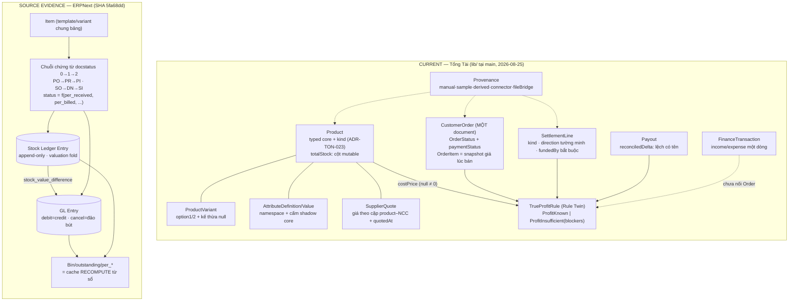

# 03 · ERPNext vs Tổng Tài — đối chiếu domain model

> WTM-449 (Epic WTM-447) · 2026-08-25 · tiếp nối `02-ERPNEXT-DOMAIN-STUDY.md`
> (ERPNext tại SHA `5fa68dd`, **GPL-3.0 — LEARN ONLY, cấm chép code**).
> Phía Tổng Tài: đọc trực tiếp `lib/` + `lib/database/tables/` tại HEAD `main`
> hôm nay. Đây **không** phải đánh giá ERPNext làm candidate thay thế — nó là
> đối chiếu để biết Tổng Tài *đã đủ ở đâu, non ở đâu, và không cần gì*.

## 0. Khung so sánh

Hai hệ giải hai bài khác nhau:

- **ERPNext**: ERP đa công ty, đa kho, đa tiền tệ, chạy server, người dùng là
  kế toán/thủ kho được đào tạo. Sự thật = **hai sổ cái append-only** (SLE + GL);
  mọi thứ khác dẫn xuất.
- **Tổng Tài**: AI Business OS local-first cho một người bán SME VN, offline,
  không kế toán viên. Sự thật = **bản ghi domain có kỷ luật null ≠ 0 +
  provenance**, và Rule Twin từ chối tính khi thiếu dữ liệu (ADR-TON-016/022).

So sánh vì thế không phải "ai có nhiều bảng hơn" mà là: **invariant nào ERPNext
mang mà bài toán của Tổng Tài cũng có, chỉ chưa lộ ra**.

## 1. Bảng map entity từng cặp

| ERPNext (evidence trong `02-`) | Tổng Tài (file thật) | Kết luận |
|---|---|---|
| `Item` (master phẳng, `item_code` là khoá, flag hạ tầng khoá cứng sau giao dịch đầu — `Item.cant_change`) | `Product` — `lib/features/tongtai/inventory/product.dart` (typed core: sku, category, pricePerUnit, costPrice, kind, quantity, reorderLevel, provenance) | **Đủ cho SME**, xem §3. Thiếu một điều đáng học: Tổng Tài chưa có khái niệm "field bị khoá sau khi có giao dịch" (đổi `kind` của product đã bán = viết lại lịch sử). |
| `Item` template/variant (`has_variants`/`variant_of`, một bảng chung; variant = Item đầy đủ; template cấm giao dịch ở 3 tầng) | `ProductVariant` — `lib/features/tongtai/commerce/commerce_models.dart` (option1/option2 name+value, giá/tồn **kế thừa cha khi null**) | Khác triết lý nhưng **cùng đích**, xem §5. |
| `Item Attribute` (master + numeric range/increment) + `Item Variant Attribute` | `AttributeDefinition`/`AttributeValue` — `lib/features/tongtai/commerce/attributes/attribute_models.dart` (9 type, namespace `system.`/`user.`/`vendor.`, cấm shadow core — `kCoreShadowedFields`) | Tổng Tài **mạnh hơn** ở governance namespace + import 4-bucket; ERPNext mạnh hơn ở validation numeric (from/to/increment) — đáng học. |
| `Item Group` (NestedSet tree) | `Product.category` (chuỗi phẳng, vocab `ProductCategory`) | Phẳng là đủ cho một shop; tree chỉ cần khi phân cấp báo cáo — **chưa cần**. |
| `UOM` + `UOM Conversion Detail` (`stock_qty = qty × conversion_factor` xuyên hệ thống) | `OrderItem.unit` là **chuỗi rỗng chờ Inventory có field** (`order.dart:58`) | **Lỗ hổng thật có ngày hẹn**: bán sỉ VN (thùng/lốc/cái) cần đúng một phép nhân này. Xem §3. |
| `Item Price` (key 8 chiều: price_list · uom · customer/supplier · valid_from/upto · batch) + Pricing Rule | `Product.pricePerUnit` (một giá) + `OrderItem.unitPrice` (snapshot giá bán thật lúc chốt đơn) | Một giá + snapshot là **đủ và đúng** cho SME; cái đáng học không phải bảng giá 8 chiều mà là **giá có hiệu lực thời gian** (`SupplierQuote.quotedAt` đã làm đúng hướng này). |
| `Supplier` (on_hold/hold_type, payment_terms, 2 công tắc nới lỏng 3-way match) | `producers` table + `lib/features/tongtai/producer/supplier*.dart` | Đủ cho hồ sơ NCC. Chưa có khái niệm "chặn giao dịch với NCC này" — nhỏ, chưa cần. |
| `Supplier Quotation` (chứng từ docstatus, giá theo cặp item–supplier, hết hạn) | `SupplierQuote` — `lib/database/tables/supplier_quotes.dart` (giá theo cặp product–supplier, `quotedAt`, supplierId nullable **có chủ đích**) | **Tương đương về khái niệm lõi.** Tổng Tài đúng khi không ép FK tới producers; ERPNext thêm docstatus + expiry — chưa cần. |
| `Purchase Order → Purchase Receipt → Purchase Invoice` (per_received/per_billed, Stock Received But Not Billed) | **Không tồn tại** — mua hàng hôm nay = `FinanceTransaction(expense)` + sửa tay `products.totalStock` | Khoảng trống lớn nhất phía mua. **Chưa phải làm ngay**, nhưng ngày làm phải mang theo invariant per_* recompute — xem §4. |
| `Customer` (credit limit cascade 3 tầng, loyalty, group tree) | `customers` table + CDP (identity, WTM-297) | Tổng Tài đủ; credit limit dạng "khách này còn nợ bao nhiêu" mới là bản SME của khái niệm này — dẫn xuất được từ `paymentStatus`, không cần bảng riêng. |
| `Sales Order → Delivery Note → Sales Invoice` (3 chứng từ, status derive từ per_*; SI độc lập + `update_stock=1` là luồng POS chuẩn) | `CustomerOrder` — `lib/features/tongtai/orders/order.dart` (**một document gánh cả ba vai**: OrderStatus fulfilment + paymentStatus + line snapshot) | Một-document là **đúng mô hình SME** — chính ERPNext thừa nhận qua SI-độc-lập. Cái thiếu không phải số chứng từ mà là **per_paid/partial cho từng phần** — xem §3. |
| Return (`is_return`, qty âm, `return_against` trỏ chứng từ gốc, StockOverReturnError) | `SettlementKind.refund` (một dòng đối soát gắn đơn) + `OrderStatus.cancelled` | Refund-as-settlement là đúng cho bán sàn; nhưng "trả một phần của đơn 3 món" chưa biểu diễn được — ghi nhận, chưa cần. |
| `Stock Ledger Entry` (append-only, on_cancel throw, valuation fold theo thời gian) + `Bin` (cache recompute được) | `products.totalStock` — **một cột mutable, không sự kiện nguồn** | Khác biệt nền tảng lớn nhất toàn bảng — xem §4 và FLAG-check §6. |
| `Warehouse` (NestedSet, group không giao dịch) | Một kho ngầm định | Đủ. Đa kho là điểm ERPNext quá-enterprise với user Tổng Tài. |
| Reorder (`Item Reorder` per-kho: level + qty + type + lead time ⇒ sinh Material Request) | `Product.reorderLevel` + `needsRestock` (một chủ — WTM-213) + Rule Engine sinh opportunity | Tổng Tài đúng nguyên tắc một-chủ; ERPNext trả lời đủ 4 câu (khi nào/bao nhiêu/cách nào/kịp lúc nào) — **đáng học 2 câu còn thiếu: bao nhiêu (reorder qty) và kịp lúc nào (leadTimeDays đã có trên SupplierQuote nhưng chưa nối vào cảnh báo)**. |
| `GL Entry` (debit=credit cưỡng bức, cancel = đảo bút, outstanding derive từ sổ) | `FinanceTransaction` (income/expense một dòng) + `SettlementLine`/`Payout` + `TrueProfitRule` | Tổng Tài **không cần double-entry** (§3), nhưng đã tự tái phát minh đúng phần lõi của GL theo cách SME: chiều tiền tường minh, số luôn dương, dấu sinh một chỗ (`signedImpact`), từ chối tính khi thiếu — xem §6. |
| `Payment Entry` + `Payment Ledger Entry` (outstanding recompute, không decrement) | `CustomerOrder.paymentStatus` (`paid`/`unpaid`/`partial`, null = chưa ghi nhận) | Đủ hôm nay. Ngày làm sổ nợ khách hàng: **học recompute-từ-bản-ghi, cấm cột "đã trả" cộng dồn**. |
| `Provenance`? — ERPNext **không có**: mọi bản ghi ngang quyền nhau | `ProvenanceSource` — `lib/features/tongtai/core/provenance.dart` (manual/sample/derived/connector/fileBridge + `inferred`) | Chiều Tổng Tài **hơn hẳn** — ERPNext không phải trả lời "dữ liệu này từ file tháng trước hay sync sáng nay" vì nó *là* hệ thống ghi sổ gốc. Tổng Tài là hệ *hợp nhất* nguồn, nên provenance là đúng đầu tư. |

## 2. Hai bức tranh cạnh nhau

Đọc cạnh nhau, khác biệt cấu trúc thật sự chỉ có **một**: bên phải mọi con số
đứng trên một **sổ sự kiện bất biến**; bên trái phần *tiền* đã có dạng sổ
(SettlementLine append + dấu sinh một chỗ) nhưng phần *kho* thì chưa
(`totalStock` là cột bị ghi đè).

## 3. Model nào của Tổng Tài đã đủ · quá đơn giản · và ERPNext nào quá enterprise

### 3.1 Đã đủ cho SME VN (giữ nguyên, đừng "nâng cấp" theo ERPNext)

- **Một document `CustomerOrder`** thay cho SO→DN→SI: chính ERPNext xác nhận
  mô hình này hợp lệ — `so_dn_required()` mặc định "No" và SI + `update_stock=1`
  là luồng POS tiêu chuẩn của họ. Ba chứng từ chỉ cần khi *ba nghĩa vụ tách
  thời điểm* (đặt ≠ giao ≠ thu) do nhiều người xử lý — một người bán không cần.
- **`OrderItem` snapshot giá lúc bán** (order.dart:8-13): trùng khớp nguyên tắc
  ERPNext (dòng chứng từ giữ rate riêng, đổi Item Price không đổi chứng từ cũ).
- **`SupplierQuote` theo cặp product–NCC + `quotedAt`**: đúng phần lõi của
  Supplier Quotation; `supplierId` nullable là quyết định đúng mà ERPNext không
  cần tới (họ ép master trước — hợp doanh nghiệp lớn, sai với người đi chợ giá).
- **`SettlementLine` + `TrueProfitRule`**: xem §6 — phần này Tổng Tài không
  thiếu gì so với ERPNext; nó giải một bài ERPNext *không có* (phí sàn đối soát
  từng đơn với fundedBy).
- **`Provenance` + `ImportJob`**: ERPNext không có gì tương đương vì không cần;
  với Tổng Tài đây là nền của File Bridge — giữ.

### 3.2 Quá đơn giản — thiếu invariant cụ thể (xếp theo độ đau)

1. **Kho không có sổ.** `products.totalStock` bị ghi đè tại chỗ, không có bảng
   movement. Invariant ERPNext mà bài toán này *sẽ* cần: (a) mỗi thay đổi tồn
   là **một sự kiện có nguồn** (`voucher_type/voucher_no` — bên Tổng Tài sẽ là
   orderId/importJobId/lý do kiểm kê); (b) tồn hiện tại = **fold của sự kiện**,
   sửa quá khứ = sự kiện đảo, không ghi đè; (c) kiểm kê = **đặt số tuyệt đối
   như một sự kiện** (Stock Reconciliation), không phải sửa cột. Không có (a)
   thì AI Copilot không bao giờ trả lời được *"sao tồn còn 3?"* — đúng câu
   Founder sẽ hỏi. Lưu ý: **không** cần valuation FIFO/queue ngay — chỉ cần sổ
   sự kiện; giá vốn moving-average là bước sau và cũng chỉ khi có nhập nhiều giá.
2. **Không có giá vốn theo thời điểm.** `Product.costPrice` là *một* số hiện
   hành; bán tháng trước với giá nhập cũ, nhập lô mới giá khác ⇒ TrueProfit
   của đơn cũ **đổi ngược quá khứ**. ERPNext chốt giá vốn *tại thời điểm xuất*
   (`get_incoming_rate` một cửa). Bản SME: **snapshot costPrice vào OrderItem
   lúc chốt đơn** — đúng như đã snapshot `unitPrice`. Đây là fix nhỏ, giá trị
   lớn, cùng họ với quyết định WTM-126 đã có.
3. **`unit` chưa tồn tại** (`OrderItem.unit` chuỗi rỗng chờ sẵn): bán sỉ
   thùng/lốc/cái cần `stock_qty = qty × conversion_factor` — một bảng quy đổi
   nhỏ trên Product, không cần doctype UOM toàn cục.
4. **Reorder mới trả lời 1/4 câu**: có level (`stockAlertLevel`), chưa có
   *đặt bao nhiêu* và *bao lâu thì về* — trong khi `SupplierQuote.leadTimeDays`
   và `minimumOrderQuantity` **đã nằm trong schema** mà chưa nối vào cảnh báo.
   Đây đúng hình dạng P-31 ("thêm trường xong nửa dưới").
5. **Mua hàng không có vòng đời**: đặt NCC 100 cái – nhận 80 – thiếu 20 hôm nay
   không ghi được ở đâu. Ngày làm (khi Producer capability lớn lên), invariant
   phải mang theo: per_received **recompute bằng tổng từ bản ghi nhận hàng**,
   cấm cột cộng dồn.

### 3.3 ERPNext quá enterprise — ghi rõ để không bao giờ vác về

- **Đa công ty, đa kho cây, cost center, fiscal year, accounting dimension** —
  toàn bộ trục này không có người dùng ở Tổng Tài.
- **Double-entry GL + chart of accounts**: người bán SME không đọc được bút
  toán; thứ họ cần là TrueProfit trả lời được "vì sao" — Tổng Tài đã có bản
  dịch đúng (blockers thay vì tài khoản).
- **Pricing Rule engine** (priority, mixed conditions, cumulative, free item):
  bài toán của chuỗi bán lẻ có phòng thương mại; SME VN giảm giá bằng tay và
  snapshot `unitPrice` đã ghi nhận trung thực.
- **Batch/Serial + serial_and_batch_bundle, Production Plan/MRP, POS
  consolidation, loyalty, subcontracting**: ngoài phạm vi sản phẩm.
- **Taxes and Charges 5 charge_type + inclusive-tax giải hệ affine**: thuế
  khoán hộ kinh doanh VN không cần cấu trúc này; một dòng `SettlementKind.tax`
  là đủ trung thực.

## 4. Invariant/lifecycle đáng học nhất

Rút từ `02-` §8, xếp lại theo mức áp dụng được cho Tổng Tài:

| Invariant ERPNext | Bản dịch Tổng Tài | Trạng thái |
|---|---|---|
| Cache = recompute từ nguồn, cấm cộng dồn (`per_*` SQL SUM, `outstanding` từ PLE, `Bin.recalculate_values`) | Đã là luật nhà (P-27/P-28, anti-cộng-dồn WTM-297, Summary Count == Domain Visible) | **Đã có** — ERPNext xác nhận luật đúng ở quy mô 15 năm |
| Sổ sự kiện bất biến + đảo bút (`SLE.on_cancel` throw, `make_reverse_gl_entries`) | Phần tiền: SettlementLine đã append-only về tinh thần. Phần kho: **chưa có** | **Học — món chính** (§3.2-1) |
| Snapshot giá trị tại thời điểm nghiệp vụ (`get_incoming_rate` lúc xuất kho) | `unitPrice` đã snapshot; `costPrice` thì chưa | **Học — fix nhỏ** (§3.2-2) |
| Status = hàm thuần của số đo, khai báo một chỗ (`status_map`) | `stockStatus`/`needsRestock` đã đúng mẫu này ở mức getter; OrderStatus còn là enum tự do người bán đặt | Học một nửa: khi có per_paid/per_received thì status phải derive, không cho đặt tay tuỳ tiện |
| Trường hạ tầng khoá cứng sau giao dịch đầu (`Item.cant_change`: is_stock_item, valuation_method) | Chưa có: đổi `Product.kind` sau khi đã có đơn = viết lại lịch sử ngầm | **Học — rẻ**: một validation ở repository |
| Nới lỏng quy trình là *chính sách có tên field* (`allow_purchase_invoice_creation_without_*`, `skip_delivery_note`, so_required mặc định No) | Tổng Tài đi từ phía ngược lại (tối giản trước) — đúng chiều cho SME | Ghi nhận làm bằng chứng cho hướng hiện tại |

## 5. Typed core vs dynamic attribute — đối chiếu với WTM-333/334

Cách ERPNext làm (evidence `02-` §3.1 + trace `item_variant.py`):

- Mọi field *giao-dịch-được* là **typed column** trên Item; variant là **một
  Item row đầy đủ** (`variant_of`), nên tầng kho/kế toán/giá không cần biết
  variant tồn tại — mỗi variant tự có SLE, Bin, Item Price.
- Thuộc tính (màu/size) sống trong **child table + master Item Attribute** có
  validation (enum value phải thuộc master; numeric phải trong
  `from_range..to_range` và là bội của `increment` —
  `validate_is_incremental`, item_variant.py:112).
- Bộ field copy template→variant **cấu hình runtime** (`Item Variant Settings`
  + `Variant Field`), có exclude cứng (`valuation_rate`, `barcodes`).
- Danh tính variant = **tập thuộc tính** (`find_variant` match đúng bộ), SKU
  **dẫn xuất** từ abbr (`make_variant_item_code` → `TSHIRT-RED-M`).

Đối chiếu quyết định WTM-333/334 của Tổng Tài (typed core +
`AttributeDefinition` namespace + cấm shadow — `kCoreShadowedFields`,
attribute_models.dart:105):

- **Cùng kết luận nền**: cái gì tham gia tính tiền/tồn thì typed, cái gì mô tả
  thì đi tầng attribute có governance. ERPNext là bằng chứng độc lập rằng ranh
  giới WTM-333/334 vẽ đúng chỗ (họ chặn `Item Price` cho template và cấm
  attribute đè field giao dịch bằng chính cấu trúc bảng).
- **Tổng Tài hơn**: namespace `vendor.<name>.*` + import 4-bucket
  (`classifyAttributeImport` — không field nào biến mất) là bài ERPNext không
  có vì họ không nhập từ nguồn lạ; và `kCoreShadowedFields` là bản tường minh
  của thứ ERPNext chỉ đạt được ngầm qua schema.
- **Đáng học từ ERPNext**, theo thứ tự: (1) **numeric attribute có
  range/increment** — `AttributeType.integer/decimal` của Tổng Tài validate
  *kiểu* nhưng chưa validate *miền giá trị*; (2) **danh tính variant = tập
  option, có dedupe** — `ProductVariant` hiện cho phép hai variant trùng
  "Đen/S" mà không ai chặn (cùng họ `find_variant`); (3) **luật tồn kho khi có
  variant**: ERPNext cấm template có stock (`ItemTemplateCannotHaveStock`);
  Tổng Tài `Product.totalStock` và `ProductVariant.quantity` chưa khai ai là
  chủ khi cả hai cùng có số — một chỗ hở đúng họ P-27 (hai nơi cùng giữ một
  con số) chưa phát nổ vì variant mới nhập từ File Bridge, chưa có đường ghi.
- **Không học**: variant = full row nhân bản mọi field. Với mobile local-first,
  mô hình kế thừa-khi-null của `ProductVariant` (effectiveSellingPrice) gọn và
  đúng hơn cho quy mô vài chục variant; cái giá 600-variant-guard của ERPNext
  cho thấy full-row không rẻ.

## 6. "Business Truth thứ hai" — ERPNext giải bằng gì, và FLAG-check

Câu hỏi của Task Order: *chỗ nào có nguy cơ hai nơi cùng tính một con số, và
ERPNext giải bằng gì?*

**ERPNext giải bằng một câu:** sổ là chủ duy nhất của sự thật; mọi con số thứ
hai (outstanding, per_billed, Bin, status, GL-của-kho) đều là **dẫn xuất có
công thức, recompute từ sổ, và có đường dựng lại toàn phần** — chính là
P-27/P-28 của Tổng Tài phát biểu bằng SQL. Không phải "GL là nguồn duy nhất
của mọi thứ": kho có sổ riêng (SLE), tiền có sổ riêng (GL), công nợ có sổ chiếu
(PLE sinh trong cùng transaction với GL) — **mỗi miền một sổ, mỗi số một chủ,
và cầu nối giữa hai sổ là một trường có tên** (`stock_value_difference`).

**FLAG-check (Task Order checkpoint):** *"nếu ERPNext cho thấy Business Truth
model hiện tại của Tổng Tài SAI NỀN TẢNG ⇒ FLAG"*.

**Kết luận: KHÔNG FLAG.** Business Truth model của Tổng Tài (một khái niệm một
chủ · null ≠ 0 · chiều tiền tường minh · Rule Twin từ chối tính · provenance)
**đồng dạng** với mô hình ledger-and-derivations của ERPNext — hai cách phát
biểu của cùng một kỷ luật. Đối chiếu này *củng cố* nền hiện tại chứ không lật nó.

Ba **vết hở cụ thể** (không phải sai nền tảng) ghi lại để có chủ:

1. **`products.totalStock` là số không có nguồn** — miền duy nhất chưa theo
   kỷ luật "số có chủ + dựng lại được" (§3.2-1). Khi Inventory lớn lên (nhập
   hàng, kiểm kê, đa nguồn ghi), đây là chỗ Business-Truth-thứ-hai sẽ mọc.
2. **`Product.stockValue = pricePerUnit × quantity`** (product.dart:293) —
   docstring nói *"tiền đang nằm trong kho"* nhưng công thức dùng **giá bán**;
   vốn nằm trong kho là `costPrice × quantity`, còn `pricePerUnit × quantity`
   là doanh thu tiềm năng. Hai khái niệm thật, một getter đang trộn — discrepancy
   đúng nghĩa (ERPNext: stock_value luôn theo valuation, không bao giờ theo giá
   bán).
3. **Hai thế hệ kỷ luật enum đang sống chung**: `OrderStatus.fromStorage` mã lạ
   → `pending`, `TransactionType.fromStorage` mã lạ → `expense`
   (tongtai_enums.dart) — trái luật ADR-TON-018 "mã lạ = bản ghi hỏng, không
   default" mà `ProvenanceSource.fromCode`/`SettlementKind.fromCode` đã theo.
   Enum cũ chưa được nâng chuẩn.

## 7. Anti-overengineering — nếu KHÔNG học ERPNext, Workizen mất gì?

Trả lời thẳng:

- **Không mất**: code (cấm chép — GPL), module system, workflow engine, chuỗi
  ba chứng từ, double-entry, pricing engine, đa kho. Không học gì trong đó thì
  Tổng Tài vẫn đúng là chính nó.
- **Mất thật, thứ nhất**: bộ **invariant đã trả giá 15 năm** cho đúng những
  bảng Tổng Tài *sẽ* thêm (stock movement, purchase lifecycle, sổ nợ khách).
  Không học thì đến ngày đó sẽ tự phát minh — và phiên bản tự phát minh đầu
  tiên thường là **cột cộng dồn** (đúng cái ERPNext cấm bằng cấu trúc, và đúng
  họ lỗi P-27 repo này đã dọn bốn lần).
- **Mất thật, thứ hai**: bằng chứng rằng **hướng tối giản hiện tại là đúng** —
  `so_required` mặc định "No", SI-một-bước, công tắc nới lỏng per-supplier là
  ERPNext thú nhận SME không đi chuỗi đầy đủ. Thiếu bằng chứng này, áp lực
  "làm cho giống ERP" sẽ quay lại mỗi lần bàn về Producer/Inventory.
- **Mất thật, thứ ba**: ba vết hở ở §6 (totalStock không nguồn, stockValue trộn
  giá bán, dedupe variant) — đều được nhìn thấy *nhờ* đặt cạnh ERPNext, không
  cái nào tự lộ từ bên trong.

## 8. Verdict 5 trục

| Trục | Verdict | Lý do |
|---|---|---|
| **Architecture** (Frappe server, DocType meta-framework, hooks, background repost queue) | **LEARN ONLY** | Multi-tenant server-side, metadata-driven UI, MariaDB/Redis — nghịch hướng local-first Flutter/Drift (D-5, ADR-TON-001). Học được: chuỗi base-controller làm chỗ ở duy nhất cho invariant (tinh thần `runTongtaiAction`/`ScreenDataController` đã cùng hướng), và repost-hàng-đợi khi sửa quá khứ. |
| **Domain model** (Item/variant, chứng từ per_*, SLE/GL/PLE, reorder) | **ADAPT** | Không bê bảng nào nguyên trạng, nhưng chuyển thể có chọn lọc các invariant §4: sổ sự kiện kho (bản tối giản), snapshot costPrice vào OrderItem, khoá trường hạ tầng sau giao dịch, numeric-range cho attribute, dedupe variant theo option, reorder đủ 4 câu. Mỗi mảnh đều rơi đúng vào gap đã có tên ở §3.2, không mảnh nào kéo theo hạ tầng ERP. |
| **Source code** | ⛔ **REJECT** | **GPL-3.0** — cấm chép vào codebase Apache-ecosystem của Workizen dưới mọi hình thức, kể cả "dịch sang Dart". Chỉ đọc để hiểu; mọi implementation viết lại từ nguyên lý, trong repo này, bằng luật của repo này. |
| **Infrastructure** (MariaDB/Redis/Node build, bench, multi-tenant site) | **REJECT** | Trái trực diện Local First + không backend Phase 2 (D-5). Không có cả trường hợp "self-host tham khảo" — Grafana/Prometheus đã gỡ, không thêm hệ vận hành mới. |
| **UX** (desktop form ERP, trường dày đặc, vai trò kế toán/thủ kho) | **LEARN ONLY** | Ngược người dùng đích (mobile, một người, AI-first — không thể ADOPT). Học đúng một điều: **status kể nghĩa vụ còn lại** ("To Receive and Bill" nói *còn thiếu gì*, không chỉ *đang ở đâu*) — cùng ngữ pháp với `ProfitInsufficient(blockers)` đã có; áp cho đơn hàng/nhập hàng khi các per_* ra đời. |

---

*Điều tra viên ghi chú: đối chiếu này dựa trên trace thật hai phía (ERPNext SHA
`5fa68dd`; Tổng Tài `main` 2026-08-25). Ba vết hở §6 là quan sát nghiên cứu —
đưa vào backlog hay không là việc của PM/Founder, không tự hành động trong
story này.*
