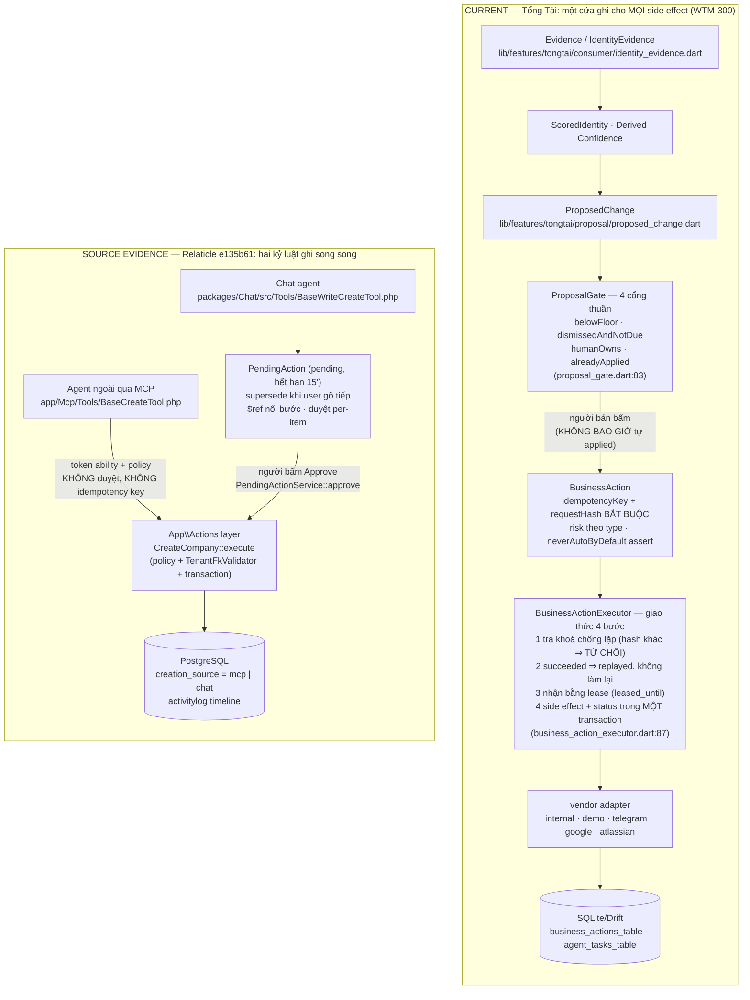

# 05 · Relaticle vs Tổng Tài — đối chiếu Agentic Foundation

> WTM-450 (Epic WTM-447) · 2026-08-25. Relaticle tại SHA `e135b61`
> (AGPL-3.0 ⇒ ⛔ code); Tổng Tài tại `main` hiện hành (Agentic Foundation
> WTM-296/297/300/301, ADR-TON-024). Mọi ô bảng đều có path thật đứng sau.

## Bản đồ khái niệm

| Relaticle | Tổng Tài | Nhận xét |
|---|---|---|
| MCP Tool (`app/Mcp/Tools/*`, 32 cái) + Chat Tool (`packages/Chat/src/Tools/*`, 36 cái) | `BusinessActionType` (từ vựng đóng `<miền>.<việc>` — `lib/features/tongtai/action/business_action.dart:79`) + Capability Context (ADR-TON-016) | Relaticle: capability = **class tool**; Tổng Tài: capability = **mã trong từ vựng đóng mang sẵn risk**. Tool là bề mặt gọi; type là luật. |
| `CustomField` (+ `custom_field_values` typed columns, vendor `relaticle/custom-fields`) | `AttributeDefinition` / `attribute_definitions_table` + `attribute_values_table` (`lib/database/tables/attribute_definitions.dart`, `lib/features/tongtai/commerce/attributes/attribute_models.dart`) | Cùng họ typed-metadata + options + tenant-unique code. Relaticle hơn: `validation_rules` per-field, filter operator per-type, agent sửa được schema. Tổng Tài hơn: namespace `system/user/vendor` + `kCoreShadowedFields` chặn shadow core field **bằng cấu trúc** (Relaticle chặn bằng một câu prompt). |
| `Company`/`People` + `team_id` | `Customer` + `ExternalIdentity` (`lib/database/tables/external_identities.dart`) | Relaticle: một People = một hàng, không có khái niệm danh tính đa nền tảng, không có `confidence`. Tổng Tài: khoá `(business, connection, platform, externalId)` + confidence + linkKind — mô hình danh tính giàu hơn hẳn vì bài toán khác (khách từ nhiều sàn). |
| Schema resources `relaticle://schema/*` (per-team, cache 60s, `app/Mcp/Resources/`) | Capability Matrix (WTM-293) + catalog-là-dữ-liệu (ADR-TON-024 §3) | **Cùng nguyên tắc** "AI đọc catalog lúc runtime, không nướng vào prompt". Relaticle đã *serve* nó cho agent ngoài qua MCP; Tổng Tài mới dùng nội bộ (Tool Runtime chưa bật — ADR-TON-016). |
| `PendingAction` (Pending·Approved·Rejected·Expired·Superseded — `packages/Chat/src/Models/PendingAction.php`) | **HAI** khái niệm tách nhau: `ProposedChange` (đổi sự thật — proposed·applied·dismissed·superseded) + `BusinessAction` (việc ra ngoài — planned·approved·running·succeeded·failed·cancelled) | Relaticle gộp "đổi field" và "việc làm" vào một model duyệt chung. Tổng Tài tách — và docblock `proposed_change.dart:129–139` nói đúng lý do: gộp thì ép "gửi tin" mang evidence[] và ép "giá vốn 45.000" mang idempotencyKey. |
| `CreationSource` enum (web·system·import·api·mcp·chat) | `Provenance` (`lib/features/tongtai/core/provenance.dart`) + `proposedBy`/`requestedBy` trên BusinessAction | Cùng mục đích. Relaticle: một cột trên bản ghi, chỉ lúc CREATE. Tổng Tài: provenance là chuỗi (evidence → confidence → ai đề nghị → ai duyệt) — sâu hơn nhưng chưa có badge UI per-record như Filament. |
| Token abilities read/create/update/delete + Policies | `AutonomyRule` 4 trường (actionType·mode·limits + assert `neverAutoByDefault`) | **Không tương đương và đừng nhầm**: abilities trả lời "*ai cầm token này* được làm gì"; AutonomyRule trả lời "*AI tự ý* được làm gì, tới hạn mức nào". Relaticle không có trục thứ hai — agent ngoài có token `create` là tạo không giới hạn, không phân biệt risk. |
| `TeamScope` + `SetApiTeamContext` + `TenantFkValidator` | cột `businessId` trên mọi bảng + local-first một máy một chủ | Multi-tenant server vs single-tenant device. Tầng isolation của Relaticle KHÔNG áp dụng cho Phase 2 — nhưng thành bài học bắt buộc nếu Phase 3 Managed có backend. |

## Hai đường ghi, cạnh nhau

Đặt cạnh nhau, khác biệt cốt lõi hiện ra: **Tổng Tài có MỘT cửa và mọi thứ đi
qua nó, kể cả ghi vào chính DB mình** (`ActionVendor.internal` —
`business_action.dart:11–13`); **Relaticle có một TẦNG chung nhưng hai cửa**, và
cửa dành cho agent *ngoài* lại là cửa **ít kiểm soát hơn** (không duyệt, không
chống lặp). Cùng hình dạng lỗi mà study COMP AI đã gọi tên: bề mặt mới rơi vào
đường yếu nhất.

## Chỗ Tổng Tài đi trước (kiểm bằng code, không phải đoán)

| # | Thứ | Evidence Tổng Tài | Relaticle có không? |
|---|---|---|---|
| 1 | **Risk model trên loại hành động** — `ActionRisk` + `neverAutoByDefault` là **hằng số kèm assert**, không phải cấu hình | `business_action.dart:53–186, 273–292` | ❌ Không có trục risk. Delete company qua MCP = một ability `delete`, ngang hàng update một ghi chú. Họ *được phép* không có — CRM không tiêu tiền thật; Tổng Tài thì có `finance.transfer_money`. |
| 2 | **Idempotency bắt buộc trên MỌI write** — idempotencyKey + requestHash, hash khác ⇒ từ chối, succeeded ⇒ replay | `business_action.dart:334–336, 365–371`; `business_action_executor.dart:114–132` | ❌ MCP create không có key nào; Chat chỉ dedupe tình huống (proposal pending giống hệt) + warning heuristic. |
| 3 | **Lifecycle duyệt phủ TẤT CẢ bề mặt** — không có đường ghi nào của agent né được planned→approved | `business_action_executor.dart` là cửa duy nhất; governance test ranh giới (bài học "COMP AI 24 file test, 0 file kiểm ranh giới") | ⚠️ Chỉ phủ Chat. MCP ghi thẳng. |
| 4 | **Human-owned truth thắng máy** — cổng 3 `humanOwns` + `overwriteSellerEnteredData` nằm danh sách cấm auto | `proposal_gate.dart:111–114`; `business_action.dart:154–158` | ❌ Không có khái niệm field do người nhập thì agent không được đè. Agent chat/update đè trực tiếp sau duyệt, MCP đè không cần duyệt. |
| 5 | **Xét lại theo miền** — dismissed không vĩnh viễn trừ identity (`reconsiderAfter`) | `proposed_change.dart:51–58` | ❌ Rejected là rejected; chỉ có luật prompt "không tự re-propose, user hỏi lại thì tạo fresh proposal". |
| 6 | **Danh tính đa nền tảng có confidence** — `(business, connection, platform, externalId)` unique + confidence + linkKind | `external_identities.dart:26–32, 58–63` | ❌ People một chiều, không có identity resolution. |
| 7 | **Rule Twin authoritative** — số chạy không cần AI/mạng/key, AI chỉ giải thích | ADR-TON-016; `docs/02-ARCHITECTURE/CAPABILITY-BIBLE.md` | ❌ Aggregate của họ là SQL trả về cho model tự diễn giải (`AggregateCrmTool`, `CrmSummaryResource`) — đúng cho CRM, không đủ cho "cấm bịa số". |

## Chỗ Relaticle đi trước (kiểm bằng code)

| # | Thứ | Evidence Relaticle | Tổng Tài thiếu gì |
|---|---|---|---|
| 1 | **MCP exposure trọn gói** — OAuth consent bind team vào token, ability, annotations, throttle, từ chối sớm khi workspace pause | `routes/ai.php` · `ApproveAuthorizationController.php` · `ChecksTokenAbility.php` | Tổng Tài **chưa có bề mặt tool cho agent** (Tool Runtime chưa bật). Khi bật, đây là hình mẫu — VÀ phản-hình-mẫu (xem FLAG-check). |
| 2 | **Schema discovery serve cho agent** — per-tenant, field-level, `input_format`+`example`, "MUST read first", reject code lạ đóng vòng | `CompanySchemaResource.php` · `ResolvesEntitySchema.php` · `BaseCreateTool.php:44` | Capability Matrix của ta là artefact cho người/agent nội bộ đọc file; chưa là **API contract** mà agent bị *ép* đi qua. |
| 3 | **Re-inject resolution state mỗi turn** — transcript replay nói dối ("pending" mãi), nên approved/rejected/superseded phải bơm lại làm nguồn sự thật | `CrmAssistant.php:104–122, 408–469` · `PendingActionService::resolvedForConversation` | Chưa đụng — nhưng chắc chắn đụng khi AI Copilot chat hiển thị `ProposedChange` treo giữa các lượt. Ghi sổ trước khi ăn bug. |
| 4 | **`$ref` chaining trong một lần duyệt** — bước sau trỏ record bước trước chưa tạo, resolve trong transaction approve | `CrmAssistant.php:240–242` · `PendingActionService::resolvePlanReferences` | `ProposedChange` hiện là từng field đơn lẻ; chưa có "kế hoạch nhiều bước duyệt một lần". |
| 5 | **`WriteGuard` per-model** — khai báo enforcement thật sự nằm ở provider nào (`disable_parallel_tool_use`) và đâu chỉ là prompt | `packages/Chat/src/Enums/WriteGuard.php` · `CrmAssistant::providerOptions` | AI Router đa provider (ADR-TON-006) chưa có bảng "provider nào enforce được gì" — cùng một guard sẽ mạnh yếu khác nhau theo BYOK provider. |
| 6 | **Untrusted-data hygiene trong prompt** — mọi context block tự khai untrusted + sanitize label + Rule 13 | `CrmAssistant.php:232, 345–347` | Tổng Tài đọc dữ liệu từ sàn/khách (File Bridge) vào prompt — cần đúng lớp này, hiện chưa thành luật viết ra. |
| 7 | **Provenance badge per-record trên UI** — `creation_source` một cột, hiện màu ngay list view | `app/Enums/CreationSource.php:53–63` | Provenance của ta sâu (chain) nhưng chưa rẻ (một liếc thấy "bản ghi này do agent tạo"). |

## Anti-overengineering — "Không học Relaticle thì Workizen mất gì?"

**Mất thật (3 thứ, đều thuộc tương lai gần):**
1. Khi bật Tool Runtime / MCP surface (ADR-TON-016 để ngỏ), mất bộ bẫy đã được
   trả giá: tenant bind tại consent, ability ≠ OAuth scope, annotation ≠
   enforcement, resource ẩn theo quyền, từ chối sớm token vô dụng.
2. Khi AI Copilot chat nối `ProposedChange`, mất bài "transcript nói dối" (#3
   trên) — bug này *chắc chắn* xảy ra, Relaticle đã ăn và vá, comment kể lại đủ chi tiết.
3. Bài `WriteGuard` cho AI Router đa provider — BYOK nghĩa là seller tự chọn
   model, và guard "một write mỗi lượt" của ta sẽ im lặng mất hiệu lực trên
   provider không hỗ trợ, y như ca Gemini họ ghi chú.

**Không mất (đừng làm):** proposal engine (của ta tách ProposedChange/BusinessAction
đúng hơn mô hình gộp của họ) · custom fields engine (AttributeDefinition đã đủ,
lại có namespace + shadow-guard họ không có) · multi-tenant scoping (local-first
Phase 2 không có tenant thứ hai) · credit/billing/Reverb broadcast (không có
backend — D-5) · activity timeline đầy đủ (nice-to-have, chưa có người dùng đòi).

## Checkpoint FLAG-check

**KHÔNG bắn FLAG.** Câu hỏi là: Relaticle có CHỨNG MINH BusinessAction/Capability
của Tổng Tài thiếu boundary quan trọng không? Soi từng ứng viên:

- *Expiry trên proposal treo?* — `PendingAction.expires_at` 15' là vì chat
  session ngắn; `ProposedChange` chủ đích treo lâu (đề xuất sự thật, có
  `reconsiderAfter` theo miền). Khác thiết kế, không phải thiếu.
- *Ownership assert?* — `ProposalOwnership` là bài toán multi-user; Tổng Tài
  một máy một chủ, `businessId` đã khoá. Chưa áp dụng.
- *Ngược lại thì có*: Relaticle cho agent NGOÀI ghi thẳng không qua proposal
  gate — tức chính họ minh hoạ lỗ hổng mà cửa-ghi-duy-nhất WTM-300 được dựng để
  chặn. Đây là **evidence xác nhận** kiến trúc hiện tại, không phải lỗ hổng mới.

Một **ghi chú phòng ngừa** (không phải FLAG): ngày Tổng Tài mở bề mặt tool cho
agent ngoài, cám dỗ sẽ là "tool gọi thẳng repository cho nhanh" — Relaticle là
bằng chứng sống rằng làm vậy sinh hai kỷ luật ghi vĩnh viễn không hội tụ. Luật
phải viết sẵn từ giờ: **mọi write tool tương lai compile xuống BusinessAction,
không có ngoại lệ "chỉ đọc–ghi nội bộ".**

## Verdict 5 trục

| Trục | Verdict | Vì sao (một dòng) |
|---|---|---|
| **Architecture** | **LEARN / ADAPT** | Học: MCP exposure + schema-as-API + resolution re-injection + `$ref` + WriteGuard. Không đổi lõi: ProposedChange/BusinessAction tách đôi của ta đúng hơn PendingAction gộp. |
| **Domain** | **THAM KHẢO NHẸ** | CRM pipeline B2B (companies·people·opportunities) lệch domain SME thương mại VN; phần trùng (custom fields, identity) ta đã có mô hình mạnh hơn. |
| **Source code** | ⛔ **AGPL-3.0 — CẤM CHÉP** | Chỉ học kiến trúc; mọi mermaid/bảng ở đây tự vẽ lại từ việc đọc, không mang code. Network service có chỉnh sửa cũng kích hoạt nghĩa vụ mở source — qua Founder trước nếu có ý self-host. |
| **Infra** | **SKIP** | Laravel + Postgres + queue + Reverb + FPM-only tenant scoping — nghịch hoàn toàn Local-First không backend (D-5). Không có gì mang về Phase 2. |
| **UX** | **LEARN** | Proposal card duyệt per-item · supersede khi người gõ tiếp · `agent_should_stop` chấm dứt lượt sau write · cite bằng tên+URL cấm lộ raw ID · badge `creation_source`. Toàn pattern rẻ, hợp triết lý "không nhãn demo, có nút bấm". |
