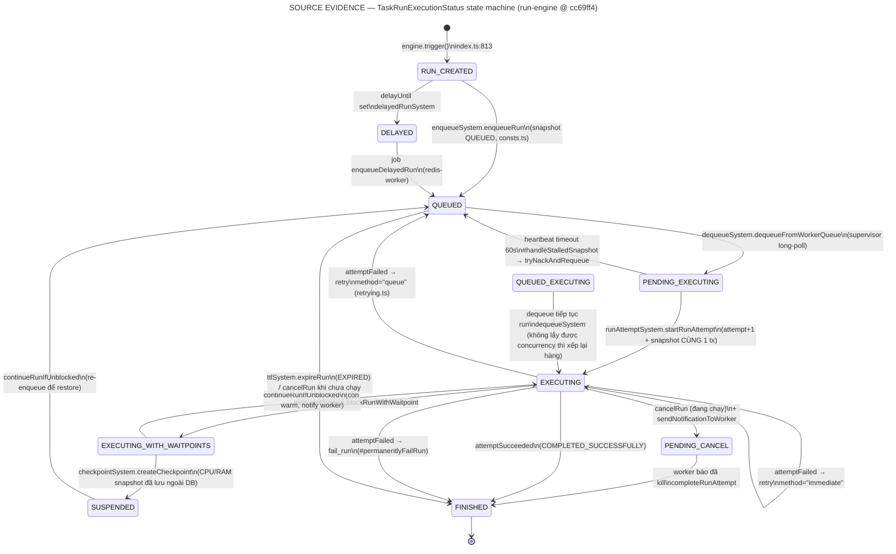

# 06 · Trigger.dev — Durable Execution Runtime (kiến trúc + lifecycle)

> WTM-451 (Epic WTM-447) · 2026-08-25 · nguồn `~/projects/_reference/trigger-dev/`
> studied SHA `cc69ff4d267fe3e6bb3e4f41f49b9bb38afe1001` (2026-08-24) · **read-only**.
> Mọi trích dẫn FILE → SYMBOL neo vào SHA này. Đối chiếu với AI-WF Runtime ở `07`.
> KHÔNG nghiên cứu UI/dashboard — chỉ runtime.

## 0 · License Gate per-package (trả lời câu treo từ `01-SOURCE-BASELINE.md`)

Doc 01 ghi "Apache-2.0, per-package kiểm ở 06". Đã kiểm từng package tại SHA:

| Vùng | Package | `license` field / LICENSE file | Kết luận |
|---|---|---|---|
| Root | `LICENSE` | **Apache-2.0** | phủ mọi thứ không tự khai khác |
| `apps/webapp`, `apps/supervisor` | private, **không có** license field | → root **Apache-2.0** | học + chép được (kèm attribution) |
| `internal-packages/*` (run-engine, run-queue, run-store, schedule-engine, database…) | private, không có license field | → root **Apache-2.0** | như trên |
| `internal-packages/otlp-importer` | `"license": "MIT"` + LICENSE MIT | **MIT** | thoáng hơn Apache |
| `packages/*` (core, trigger-sdk, cli-v3, redis-worker, build, python, react-hooks, rsc, schema-to-json, plugins) | `"license": "MIT"` (LICENSE file: "MIT License, Copyright (c) 2023 Trigger.dev") | **MIT** | thoáng hơn Apache |

- **Không tìm thấy package nào GPL/AGPL, không có thư mục `ee/` hay license thương mại riêng**
  (`find -iname "*license*"` + `find -type d -name ee` đều sạch). README chỉ badge Apache-2.0.
- Nghĩa là: **toàn bộ phần "vàng" (run-engine, redis-worker, supervisor) đều Apache-2.0 hoặc MIT**
  — về pháp lý được phép đọc, học, và chép có attribution. *Verdict ở `07` vẫn dựa trên FIT,
  không phải vì license cho phép.*

## 1 · Bản đồ kiến trúc — ai làm gì

```
SDK (task code)          Control plane                     Data plane
┌───────────────┐   ┌─────────────────────────┐   ┌──────────────────────────┐
│ @trigger.dev/ │   │ apps/webapp (Remix)      │   │ apps/supervisor           │
│ sdk · cli-v3  │──▶│  · API routes            │──▶│  · dequeue long-poll      │
│ (MIT)         │   │  · RunEngine (LIBRARY,   │◀──│  · WorkloadManager        │
└───────────────┘   │    internal-packages/    │   │    (docker.ts/kubernetes) │
                    │    run-engine — nhúng    │   │  · resourceMonitor        │
                    │    trong webapp, KHÔNG   │   └────────────┬─────────────┘
                    │    phải service riêng)   │                │ container/pod
                    │  · schedule-engine       │        ┌───────▼───────┐
                    └──────────┬──────────────┘         │ runner (1 run │
                               │                        │ = 1 container)│
        Postgres (source of truth: TaskRun,             └───────────────┘
        TaskRunExecutionSnapshot, Waitpoint…)
        Redis (run-queue, redis-worker jobs, redlock, snapshot cache)
        ClickHouse (analytics) · Electric (realtime) · Minio/S2/Registry
```

Điểm kiến trúc quan trọng nhất: **RunEngine là một thư viện** (`internal-packages/run-engine/src/engine/index.ts`,
`class RunEngine`, ~3.220 dòng) chạy **bên trong webapp**, không phải microservice.
Nó gom 12 "system" con (`src/engine/systems/`): enqueue · dequeue · runAttempt ·
executionSnapshot · waitpoint · checkpoint · batch · ttl · delayedRun · debounce ·
pendingVersion · raceSimulation. Supervisor/runner chỉ nói chuyện với webapp qua
HTTP + socket.io — không chạm DB.

## 2 · Trạng thái: HAI state machine + event-sourcing snapshot

Trigger.dev tách đôi trạng thái (evidence: `internal-packages/database/prisma/schema.prisma`):

1. **`TaskRunStatus`** — 17 giá trị, user-facing, nằm trên row `TaskRun`
   (PENDING · DEQUEUED · EXECUTING · RETRYING_AFTER_FAILURE · WAITING_TO_RESUME ·
   PAUSED · … + 8 final: CANCELED · INTERRUPTED · COMPLETED_SUCCESSFULLY ·
   COMPLETED_WITH_ERRORS · SYSTEM_FAILURE · CRASHED · EXPIRED · TIMED_OUT).
   Danh sách final cứng trong `run-engine/src/engine/statuses.ts` (`finalStatuses`).
2. **`TaskRunExecutionStatus`** — 10 giá trị, engine-facing (`schema.prisma:1399`):
   RUN_CREATED · DELAYED · QUEUED · QUEUED_EXECUTING · PENDING_EXECUTING ·
   EXECUTING · EXECUTING_WITH_WAITPOINTS · SUSPENDED · PENDING_CANCEL · FINISHED.

**Trạng thái engine KHÔNG lưu như một cột mutable** mà là **log append-only**:
model `TaskRunExecutionSnapshot` — mỗi transition tạo một row mới với
`previousSnapshotId`, `isValid` (snapshot lỗi vẫn được ghi lại làm bằng chứng),
`lastHeartbeatAt`, `completedWaitpoints[]`, `checkpointId`, `workerId/runnerId`,
index `[runId, isValid, createdAt Desc]` để lấy "trạng thái hiện tại = snapshot
hợp lệ mới nhất" (`executionSnapshotSystem.getLatestExecutionSnapshot`).
Hệ quả: *mọi* bước của run đều replay được từ DB, và mọi lệnh từ worker phải
nộp kèm `snapshotId` — lệnh trên snapshot cũ bị từ chối
(`runAttemptSystem.attemptFailed`: "Snapshot ID doesn't match the latest snapshot").

## 3 · Run lifecycle — state machine từ code



Trace từng bước (FILE → SYMBOL → điều xảy ra):

| # | Bước | File → Symbol | Ghi chú load-bearing |
|---|---|---|---|
| 1 | Tạo run | `run-engine/src/engine/index.ts` → `RunEngine.trigger()` | tạo `TaskRun` + waitpoint liên kết (`associatedWaitpoint` — để parent chờ child), armTTL, delay, debounce, priorityMs, idempotencyKey đều là param |
| 2 | Vào hàng | `systems/enqueueSystem.ts` → `enqueueRun()` | ghi snapshot `QUEUED` + đẩy vào RunQueue (Redis). Comment tại `consts.ts`: 3 chỗ phải ghi snapshot QUEUED giống hệt nhau, nếu không timeline lệch |
| 3 | Chia hàng 2 tầng | `run-engine/src/run-queue/keyProducer.ts` | env queue → **masterQueue (shard theo envId)** → **workerQueue**; key có `currentConcurrency`, `queueConcurrencyLimit` |
| 4 | Chọn queue công bằng | `run-queue/fairQueueSelectionStrategy.ts` → `FairQueueSelectionStrategy` | `#shuffleQueuesByEnv` + weighted bias (`concurrencyLimitBias`, `availableCapacityBias`) — fairness = xáo trộn có trọng số theo capacity còn lại, không phải FIFO toàn cục |
| 5 | Supervisor kéo việc | `apps/supervisor/src/index.ts` | long-poll dequeue (`TRIGGER_DEQUEUE_INTERVAL_MS` / `TRIGGER_DEQUEUE_IDLE_INTERVAL_MS`), engine trả `DequeuedMessage`, snapshot → `PENDING_EXECUTING` |
| 6 | Chạy | `apps/supervisor/src/workloadManager/docker.ts` \| `kubernetes.ts` | **1 run = 1 container/pod** (`DockerWorkloadManager`/`KubernetesWorkloadManager`); machine preset ép bằng `NanoCpus/Memory` (Docker) hay requests/limits (k8s). `resourceMonitor.ts` (preflight CPU/RAM trước dequeue) **mặc định TẮT** (`RESOURCE_MONITOR_ENABLED=false`) và `maxResources` gửi lên bị route dequeue của webapp **bỏ qua** — placement thật nằm ở preset + `backpressure/`, không phải preflight |
| 7 | Bắt đầu attempt | `systems/runAttemptSystem.ts` → `startRunAttempt()` | comment trong code: attempt-bump + snapshot EXECUTING phải nằm **CÙNG MỘT transaction** — "a crash between them leaves the run EXECUTING with no snapshot" |
| 8 | Xong | `runAttemptSystem.attemptSucceeded()` | snapshot FINISHED + status COMPLETED_SUCCESSFULLY, `runQueue.acknowledgeMessage` (nhả concurrency), `completeWaitpoint(associatedWaitpoint)` → parent được mở khoá |
| 9 | Lỗi | `runAttemptSystem.attemptFailed()` → `retrying.ts` | xem §4 |

## 4 · Retry — ai quyết, quyết bằng gì

`run-engine/src/engine/retrying.ts` → `retryOutcomeFromCompletion()` trả về đúng
một trong ba outcome: `cancel_run` · `fail_run` · `retry {method: "queue"|"immediate"}`.

- **Backoff**: `packages/core/src/v3/utils/retries.ts` → `calculateNextRetryDelay()`:
  `min(maxTimeout, random·minTimeout·factor^(attempt−1))` — exponential + jitter tuỳ chọn.
- **Trần cứng toàn hệ**: `MAX_TASK_RUN_ATTEMPTS = 250` (`engine/consts.ts`);
  trần thật là `run.maxAttempts` do task khai.
- **Phân loại lỗi trước khi retry**: `shouldRetryError(taskRunErrorEnhancer(error))`
  — lỗi không retry được (vd code sai cú pháp) fail thẳng, không đốt attempt.
- **OOM là ca riêng**: `retryOOMOnMachine()` — nếu task khai
  `retry.outOfMemory.machine`, lần retry sau chạy trên **máy to hơn** thay vì
  cùng máy chết cùng kiểu.
- **`retry` 2 đường**: `immediate` (worker còn sống, chạy lại tại chỗ) vs
  `queue` (xếp lại hàng — mặc định khi "something bad happened").
- Queue-level: nack quá `maxAttempts` của queue → **DLQ** (`run-queue/index.ts`
  `deadLetterQueueKey`, có `handleRedriveMessage` để cứu về).

## 5 · Cancellation — signal đi đường nào

`runAttemptSystem.cancelRun()` (`runAttemptSystem.ts:1347`):

1. Đang chạy → ghi snapshot **PENDING_CANCEL** + `sendNotificationToWorker()`
   (`engine/eventBus.ts:377` emit `workerNotification`).
2. webapp lắng nghe (`apps/webapp/app/v3/runEngineHandlers.server.ts:678`) → đẩy
   socket.io (`handleSocketIo.server.ts`) → supervisor nhận `run:notify`
   (`packages/core/src/v3/runEngineWorker/supervisor/session.ts:159`) → runner
   tự kill và gọi lại `completeRunAttempt` → FINISHED.
3. `finalizeRun: true` = "worker đã chết, đừng chờ nó xác nhận" → FINISHED thẳng.
4. Chưa chạy → nhấc khỏi queue (`acknowledgeMessage {removeFromWorkerQueue}`) + FINISHED.
5. **Cancel lan xuống con**: mỗi child một job `cancelRun:<childId>` qua
   redis-worker — đệ quy, có id nên không nhân đôi.

Điểm đáng học: cancel **không bao giờ là kill trực tiếp** — nó là một *trạng thái*
(PENDING_CANCEL) + một *notification*; nếu worker chết trước khi xác nhận, chính
heartbeat timeout (§6) sẽ đóng run. Không có đường nào để run "vừa cancel vừa chạy tiếp".

## 6 · Crash recovery — deadman switch bằng heartbeat

Cơ chế: **mỗi lần ghi snapshot, engine đặt một job hẹn giờ** trong redis-worker
với id cố định `heartbeatSnapshot.<runId>` (`executionSnapshotSystem.ts` —
`#getHeartbeatIntervalMs`, `enqueueHeartbeatIfNeeded`). Có **hai loại tim đập**:

- **Run heartbeat** — phát từ *bên trong container* của run
  (`packages/cli-v3/src/entryPoints/managed-run-worker.ts`, mặc định 20s —
  `TRIGGER_HEARTBEAT_INTERVAL_SECONDS`), đi runner → supervisor
  (`workloadServer/index.ts` route `/workload-actions/.../heartbeat` — supervisor
  chỉ **relay**) → webapp → engine `heartbeatRun()` **reschedule** job deadman lùi ra.
- **Worker-instance heartbeat** — supervisor tự báo sống mỗi 30s
  (`TRIGGER_WORKER_HEARTBEAT_INTERVAL_SECONDS`, `SupervisorSession` +
  `IntervalService`) → `WorkerInstance.lastHeartbeatAt`.

Runner chết ⇒ không ai lùi giờ ⇒ job nổ ⇒ `#handleStalledSnapshot`
(`engine/index.ts:2621`).

Timeout mặc định theo trạng thái (`index.ts:342`):

| Execution status | Timeout | Khi nổ thì làm gì (`#handleStalledSnapshot`) |
|---|---|---|
| PENDING_EXECUTING | 60s | `tryNackAndRequeue` — dequeue rồi mà không start được thì trả về queue, quá số lần → fail `TASK_RUN_DEQUEUED_MAX_RETRIES` |
| EXECUTING / EXECUTING_WITH_WAITPOINTS | 60s | coi là stall: DEV → lỗi timeout **không retry** ("chắc là bạn tắt CLI"); PROD → coi như crash/OOM, đi qua đúng pipeline retry §4 |
| PENDING_CANCEL | 60s | ép đóng run |
| SUSPENDED | 10 phút | `continueRunIfUnblocked` — tự chữa run treo ở trạng thái ngủ |
| RUN_CREATED / QUEUED / QUEUED_EXECUTING | — | `NotImplementedError` "There shouldn't be a heartbeat for QUEUED" — **trạng thái nằm trong queue thì queue chịu trách nhiệm, không cần tim đập** |

Cùng họ: `repairSnapshot` job (60s) sửa snapshot lệch, `expireRun:<runId>` cho
TTL (`ttlSystem.ts` — run nằm queue quá `ttl` → EXPIRED), `raceSimulationSystem`
tồn tại **chỉ để test race** có chủ đích.

## 7 · Waitpoint + Checkpoint — tạm dừng có địa chỉ

- **Waitpoint** (`schema.prisma` model `Waitpoint`, 4 loại `RUN | DATETIME | MANUAL | BATCH`):
  một run bị block bởi n waitpoint (`TaskRunWaitpoint`); khi **tất cả** COMPLETED →
  `waitpointSystem.continueRunIfUnblocked()` (chạy dưới runlock, switch đủ 10
  trạng thái — mỗi nhánh một quyết định tường minh).
  - `RUN`: parent chờ child — chính là `triggerAndWait`.
  - `DATETIME`: `wait.until` / sleep.
  - `MANUAL`: token — **đây là HITL**: SDK `wait.createToken()` / `wait.forToken()`
    (`packages/trigger-sdk/src/v3/wait.ts`), người/hệ ngoài complete bằng HTTP
    `POST api/v1/waitpoints/tokens/:friendlyId/complete` (route
    `apps/webapp/app/routes/api.v1.waitpoints.tokens.$waitpointFriendlyId.complete.ts`,
    có cả biến thể `callback.$hash`), kèm `completedAfter` làm **timeout** và
    `output` mang payload người duyệt trả về.
  - Waitpoint có `idempotencyKey` riêng (unique `[environmentId, idempotencyKey]`,
    có `idempotencyKeyExpiresAt` + `inactiveIdempotencyKey` cho debounce/cancel).
- **Checkpoint** (`systems/checkpointSystem.ts` → `createCheckpoint()`): snapshot
  **CPU/RAM của container** lưu ngoài DB; DB chỉ giữ
  `TaskRunCheckpoint {type, location, imageRef}`; run → SUSPENDED, nhả máy.
  Resume = re-enqueue → restore image → chạy tiếp giữa hàm. Chỉ trạng thái
  `isCheckpointable` mới nhận (`statuses.ts`); checkpoint về snapshot cũ bị
  **discard có ghi sổ** (`incomingCheckpointDiscarded`).
  ⚠️ **Caveat self-host**: trong repo chỉ có *client*
  (`packages/core/src/v3/serverOnly/checkpointClient.ts` POST sang một
  **checkpoint service ngoài, không open-source**; bật bằng `TRIGGER_CHECKPOINT_URL`);
  `docs/self-hosting/docker.mdx` nói thẳng "**No checkpoint support**" khi self-host.
  Tức là phần "đóng băng giữa hàm" — thứ ấn tượng nhất trên giấy — **không tự có**
  khi tự vận hành; self-host chỉ có waitpoint + suspend kiểu re-enqueue.
- `QUEUED_EXECUTING`: run tiếp tục nhưng không giành lại được concurrency —
  vẫn "đang chạy" mà xếp hàng; dequeue lần sau chuyển thẳng về EXECUTING.

## 8 · Idempotency khi trigger

`apps/webapp/app/runEngine/services/triggerTask.server.ts` →
`idempotencyKeyConcern.handleTriggerRequest()` (concern riêng:
`app/runEngine/concerns/idempotencyKeys.server.ts`): key trùng + chưa hết hạn ⇒
`isCached: true`, **trả lại run cũ, không tạo run mới**; `idempotencyKeyExpiresAt`
= TTL của key. Engine `trigger()` nhận key đã resolve — enforcement nằm ở tầng
service, model nằm ở DB (unique), không phải "nhớ trong RAM".

## 9 · Schedules

`internal-packages/schedule-engine/src/engine/`:
- `scheduleCalculation.ts` — cron qua **cron-parser** (`parseExpression`), timezone
  per-schedule (`tz`, null = UTC), tính **nominal timestamp** kế tiếp.
- `distributedScheduling.ts` — trải giờ nổ thật quanh nominal để nghìn schedule
  cùng `0 * * * *` không nổ cùng giây.
- `workerCatalog.ts` — job chạy trên `@trigger.dev/redis-worker` (chính hạ tầng §10).
- Firing → tạo TaskRun qua trigger service của webapp với `scheduleId/scheduleInstanceId`.
- *Chưa trace tới:* chính sách catch-up khi control plane chết qua nhiều mốc
  (nổ bù 1 lần hay bỏ) — cần đọc `scheduleTiming.ts` sâu hơn; không kết luận.

## 10 · Hai viên gạch nền: redis-worker + RunLocker

- **`packages/redis-worker`** (MIT): job queue nội bộ — `visibilityTimeoutMs`
  per-job, retry backoff (comment trong code: attempt 12 ≈ delay 1h), **cron**,
  và `reschedule(id, availableAt)` — chính primitive làm deadman switch §6.
  Có `fair-queue/` + `mollifier/`. Toàn bộ job vận hành của engine
  (heartbeat, expire, cancel con, continueRunIfUnblocked, enqueueDelayedRun,
  tryCompleteBatch…) khai trong `workerCatalog.ts` của engine — **một chỗ**.
- **`engine/locking.ts`** → `class RunLocker` — **Redlock** (Redis) theo `runId`:
  *mọi* transition (`startRunAttempt`, `attemptFailed`, `cancelRun`,
  `continueRunIfUnblocked`, `createCheckpoint`, `#handleStalledSnapshot`…) bọc
  trong `runLock.lock(name, [runId], …)`. Hai control-plane instance xử cùng
  run vẫn không giẫm nhau — lock nằm ở **tầng dữ liệu**, không phải "một instance
  duy nhất được chạy".

## 11 · Self-host cần gì (`hosting/docker/`)

| Service (compose) | Image | Vai trò | Bắt buộc? |
|---|---|---|---|
| `webapp` | `ghcr.io/triggerdotdev/trigger.dev` | control plane + RunEngine + dashboard | ✅ |
| `postgres` | `postgres:14` | source of truth | ✅ |
| `redis` | `redis:7` | queue + locks + jobs | ✅ |
| `electric` | `electricsql/electric` | realtime sync cho dashboard/Realtime API | gần như bắt buộc |
| `clickhouse` | `clickhouse-server:26.2` | runs analytics | nặng, khó bỏ ở bản mới |
| `registry` | `registry:2` | chứa image task đã build | ✅ cho managed worker |
| `minio` | bitnami minio | object store (payload/log lớn) | ✅ thực tế |
| `s2` + `s2-init` | s2-streamstore | realtime streams v2 | tuỳ tính năng |
| `supervisor` | `ghcr.io/triggerdotdev/supervisor` | data plane (compose riêng `hosting/docker/worker/`) | ✅ |
| `docker-proxy` | tecnativa/docker-socket-proxy | cho supervisor tạo container an toàn | ✅ đi kèm supervisor |

⇒ **~9–10 container, 4 hệ dữ liệu (Postgres · Redis · ClickHouse · Minio)**, hai
compose file tách webapp-side/worker-side, kèm Traefik option. Footprint chính
docs của họ khai (`docs/self-hosting/docker.mdx`): **máy webapp 3+ vCPU / 6+ GB,
máy worker 4+ vCPU / 8+ GB** (k8s: cả stack 6+ vCPU / 12+ GB); ClickHouse là env
**bắt buộc** của webapp (`CLICKHOUSE_URL` non-optional trong `env.server.ts`).
Đây là footprint của một **execution platform đa tenant**, không phải một daemon
— so với AI-WF hiện tại là **0 service** (file JSON + Jira làm queue).
Bỏ được: minio (mất payload lớn) · s2 (streams về v1/Redis) · electric (mất
realtime UI) · traefik. Không có trong self-host: checkpoint service, compute
gateway, warm-start service (cloud-only).

Hai chi tiết vận hành đáng chú ý:
- Supervisor xác danh bằng `TRIGGER_WORKER_TOKEN` (prefix `tr_wgt_`, hash SHA-256,
  upsert `WorkerInstance` theo `(workerGroupId, instanceName)` —
  `workerGroupTokenService.server.ts`) — **multi-supervisor là mặc định by design**;
  chống double-dequeue bằng Redis `BLPOP`/Lua pop nguyên tử + snapshot guard,
  **không có singleton lock nào cả**.
- Supervisor **không có graceful shutdown**: không một `process.on("SIGTERM")`
  nào trong `apps/supervisor/src`; `ManagedSupervisor.stop()` không được nối vào
  signal. Họ *được phép* chết bẩn vì run container độc lập với supervisor và
  toàn bộ sự thật nằm ở engine + heartbeat — supervisor chết là sự kiện đã nằm
  trong thiết kế, không phải tai nạn phải xử lý.

## 12 · Tám bài học kiến trúc rút được (không phụ thuộc việc có dùng Trigger.dev hay không)

1. **Trạng thái là log, không phải biến** — snapshot append-only + `previousSnapshotId`
   khiến "RECONCILE trước khi replay" thành phép đọc, không phải phép đoán.
2. **Mọi lệnh của worker mang `snapshotId`** — lệnh trên thế giới cũ tự chết. Đây là
   thuốc đúng cho lớp bug "hai supervisor cùng nhìn một vé".
3. **Deadman switch rẻ**: 1 job hẹn giờ theo id + reschedule khi có tim đập. Không
   cần bảng lease, không cần poll quét.
4. **Timeout theo trạng thái** (60s executing / 10min suspended / queue thì không cần)
   thay vì một timeout toàn cục.
5. **Cancel là trạng thái + notification, không phải kill** — và worker chết thì
   heartbeat đóng hộ, có đường `finalizeRun` cho "worker biết chắc đã chết".
6. **Retry phân loại lỗi trước** (`shouldRetryError`) và OOM đổi máy — retry không
   phải một số đếm.
7. **Fairness = shuffle có trọng số theo capacity**, concurrency limit enforce bằng
   Lua trong Redis — không tin process nào "tự giác".
8. **Lock theo run, không lock theo instance** — cho phép nhiều control plane/supervisor
   mà không cần "single instance guard".

→ Đối chiếu từng bài với AI-WF Runtime + verdict: `07-TRIGGERDEV-VS-AI-WF.md`.
