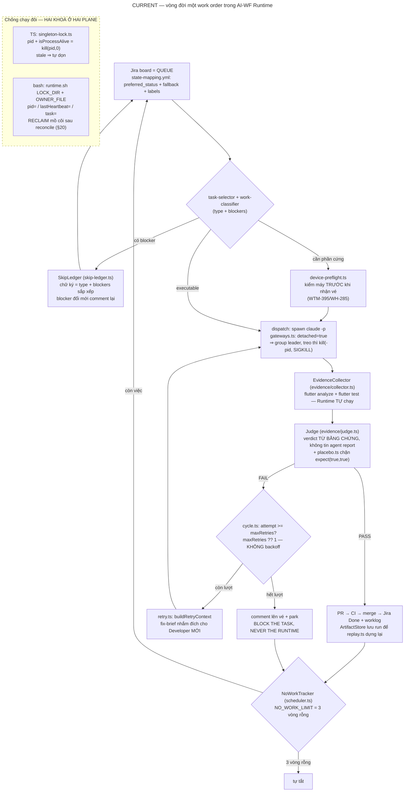

# 07 · Trigger.dev VS AI-Workforce Runtime — đối chiếu + verdict

> WTM-451 (Epic WTM-447) · 2026-08-25. Trigger.dev @ `cc69ff4` (đọc `06`) đối chiếu
> `~/projects/workizen-ai-workforce-runtime/` (**read-only** — repo của phiên khác).
> Nguyên tắc của study: KHÔNG đề xuất migrate chỉ vì source đẹp — mọi khuyến nghị
> phải trả lời được "AI-WF *mất gì* nếu không làm".

## 1 · Vòng đời task AI-WF hiện tại (từ code, không phải từ mô tả)

Đặc điểm cấu trúc (đối chiếu từng cái với Trigger.dev ở bảng §2):

- **Jira LÀ queue** — không có hàng đợi riêng; trạng thái công việc = trạng thái
  Founder nhìn thấy (đúng luật "Jira visibility" trong CLAUDE.md).
- **Hai execution plane song song**: `runtime.sh` (dispatcher bash, prompt lớn cho
  `claude -p`) và `src/autonomous/` (supervisor TS) — **hai khoá độc lập không
  thấy nhau** (LOCK_DIR của bash vs `singleton-lock.ts` của TS).
- **Không mid-run checkpoint**: một attempt `claude -p` là nguyên tử — crash giữa
  chừng mất cả attempt; sản phẩm dở dang chỉ còn trong working tree.
- **Không time-based lease**: khoá sống theo PID (`kill(pid,0)`), không theo TTL;
  `lastHeartbeat` trong OWNER_FILE có ghi nhưng **không ai đọc với timeout** —
  nó là dấu vết pháp y, không phải deadman switch.
- **RECONCILE trước replay/reclaim**: khoá mồ côi không bị cướp im lặng — reconcile
  (đối chiếu trạng thái đã ghi với Jira) rồi mới lấy lại (runtime.sh §20);
  `replay.ts` dựng lại nguyên văn những gì Runtime đã thấy từ ArtifactStore,
  không chạy lại.

## 2 · Bảng capability — file/symbol thật hai bên

| Capability | AI-WF hiện tại | Trigger.dev | Gap | Recommendation |
|---|---|---|---|---|
| Nguồn việc / queue | Jira board — `task-selector.ts`, `sync-jira.ts`, `state-mapping.yml` | Redis RunQueue 2 tầng — `run-queue/index.ts`, `keyProducer.ts`, pop nguyên tử BLPOP/Lua | Jira không có atomic-pop; bù lại **người đọc được** — thứ Founder đòi 4 lần | **GIỮ Jira-as-queue.** Đừng dựng queue riêng — mất tính nhìn-thấy là mất nhiều hơn được |
| State machine | Jira status + `state-mapping.yml` (fallback + labels); không có tầng "execution status" riêng | **2 tầng**: `TaskRunStatus` (17, user) + `TaskRunExecutionStatus` (10, engine) + **snapshot append-only** (`TaskRunExecutionSnapshot`, `previousSnapshotId`, `isValid`) | AI-WF trộn "trạng thái nghiệp vụ" với "trạng thái thực thi"; crash giữa attempt **vô hình** từ Jira | ⭐ **HỌC**: một execution-state log per work-order (file JSON append-only cũng đủ) — RECONCILE thành phép đọc |
| Attempt & retry | `cycle.ts` (`maxRetries ?? 1`, vòng Developer→collect→judge), `retry.ts` (`buildRetryContext` — fix-brief cho attempt mới, "No agent self-report") | `retrying.ts` `retryOutcomeFromCompletion` (3 ngả), backoff mũ + jitter (`core/v3/utils/retries.ts`), trần 250, OOM đổi máy to hơn | **Khác bản chất, không phải thiếu**: retry AI-WF chữa lỗi *chất lượng* bằng brief mới; backoff mũ chữa lỗi *transient* — hai loại lỗi khác nhau | GIỮ. Học đúng MỘT ý: `shouldRetryError` — phân loại lỗi transient (API 429/529, mạng) vs lỗi chất lượng, chỉ transient mới đáng chờ-rồi-thử-lại |
| Concurrency & fairness | 1 runtime / 1 repo (`singleton-lock.ts`); trong repo tuần tự | `FairQueueSelectionStrategy` (weighted shuffle theo capacity), concurrency limit enforce bằng Lua | AI-WF chưa có bài toán fairness — một Founder, vài repo | **KHÔNG học** — YAGNI |
| Cancellation / preempt | `gateways.ts`: `detached: true` ⇒ `process.kill(-pid, SIGKILL)` cả cây khi treo; runtime.sh `on_stop` (WTM-397 — nhả khoá mà con còn sống = khoá nói dối) | Cancel là **trạng thái** `PENDING_CANCEL` + notification (`cancelRun` → eventBus → socket `run:notify`); worker chết thì heartbeat đóng hộ; cancel lan xuống child theo job có id | AI-WF kill được cây (bài WTM-397 đã trả); nhưng cancel **không được ghi sổ thành trạng thái** — sau kill không có record vé bị dừng lúc nào, vì sao | HỌC nhẹ: ghi sự kiện cancel/preempt vào ArtifactStore trước khi kill |
| Graceful shutdown | `trap on_stop INT TERM` bash — tự viết, tự trả giá (3 tiến trình zombie trước WTM-397) | Supervisor **KHÔNG có** SIGTERM handler — *by design*: state nằm ngoài process nên chết bẩn vô hại | Bài học **ngược chiều trực giác**: bên "chuẩn công nghiệp" không làm graceful shutdown — họ làm **crash-vô-hại** | ⭐ HỌC TƯ TƯỞNG: mục tiêu không phải "tắt đẹp" mà "chết lúc nào cũng không mất sự thật" |
| Crash recovery | `singleton-lock.ts` stale-detect `kill(pid,0)`; RECLAIM sau reconcile; attempt đang chạy thì **mất, không ai biết cho tới lần khởi động sau** | Deadman switch: job `heartbeatSnapshot.<runId>` reschedule theo tim đập (20s), timeout theo trạng thái (60s/10min), `#handleStalledSnapshot` xử từng ngả | ⚠️ **Gap thật #1**: AI-WF không có watchdog NGOÀI tiến trình — supervisor chết là im lặng tuyệt đối (đúng loại lỗi "board đứng im thì không gì đỏ" Founder đã nêu) | ⭐ **HỌC**: OWNER_FILE đã có `lastHeartbeat` — chỉ thiếu MỘT watchdog (launchd/cron 1 dòng) đọc nó với timeout và báo Founder |
| Checkpoint / resume | Không có mid-run checkpoint; `ArtifactStore` lưu **sau** khi xong | Waitpoint 4 loại + suspend; CRIU checkpoint **cloud-only — self-host của chính họ cũng không có** (`docs/self-hosting/docker.mdx`: "No checkpoint support") | Chính Trigger.dev self-host sống không cần checkpoint ⇒ "mất attempt khi crash" là chi phí chấp nhận được khi attempt idempotent | **KHÔNG build** checkpoint cho model run. Giữ attempt-nguyên-tử + safe-git |
| Idempotency | `skip-ledger.ts` (`skipSignature` = type + blockers sort; hỏng ⇒ coi như rỗng — "thà ồn còn hơn câm"); completed-keys chống làm lại | `IdempotencyKeyConcern` (webapp `runEngine/concerns/idempotencyKeys.server.ts`) — unique DB + TTL + trả run cũ; waitpoint idempotency riêng | Cùng một ý — AI-WF bản file, Trigger.dev bản DB. Đủ dùng cho scale hiện tại | GIỮ |
| Schedules | `runtime.sh` vòng lặp + nap/cool; `handover.sh` + `caffeinate` | `schedule-engine`: cron-parser + timezone + `distributedScheduling` | AI-WF không cần cron đa tenant | KHÔNG học |
| HITL | Founder Gate = Jira comment + park vé ("BLOCK THE TASK, NEVER BLOCK THE RUNTIME", `state-mapping.yml`) | `MANUAL` waitpoint: `wait.createToken/forToken` + HTTP complete + `completedAfter` timeout | Jira comment chính là "token" của AI-WF — và giàu ngữ cảnh hơn cho người | GIỮ. Học MỘT ý: waitpoint có **timeout** — gate chờ quá N ngày nên tự nhắc thay vì im |
| Worker ownership | **Hai khoá ở hai plane không thấy nhau** (bash `LOCK_DIR`+OWNER_FILE vs TS `singleton-lock.ts`) | **Không khoá instance nào cả**: `BLPOP` nguyên tử + mọi lệnh worker mang `snapshotId`, lệnh trên snapshot cũ bị từ chối (fencing theo dữ liệu) | ⚠️ **Gap thật #2**: chống-chạy-đôi bằng lock-instance thì mỗi plane mới lại cần một lock mới — hai lock độc lập là lớp bug đã thành hình | ⭐ **SỬA**: một khoá duy nhất cả hai plane cùng đọc, HOẶC fencing theo work-order (vé mang attempt-id, hành động sai id bị từ chối) |
| State persistence | `ArtifactStore` JSON + skip-ledger JSON + Jira; mất gì khi crash: attempt đang chạy | Postgres (source of truth) + Redis + snapshot log | File JSON đủ ở scale 1 Founder; cái thiếu không phải DB mà là **log trạng thái thực thi** (hàng 2) | GIỮ file-based; thêm execution-log |
| Observability / replay | `replay.ts` `formatReplay` — dựng lại verdict/evidence từ artifacts, **không chạy lại** | `getSnapshotsSince` + dashboard + ClickHouse | Triết lý **giống nhau** (event log → replay) — AI-WF đã có mầm đúng, chỉ hẹp hơn (artifact sau-khi-xong vs snapshot từng-transition) | Phát triển replay hiện có thành execution-log đầy đủ (hàng 2) — không cần ClickHouse |

## 3 · Trả lời dứt điểm

### "AI-WF có đang tự build lại durable execution framework không?"

**Không.** Phân định bằng code:

- Phần **trùng với Trigger.dev** (generic runtime plumbing): singleton lock, kill
  process tree, no-work shutdown, skip-ledger, retry loop — cộng lại vài trăm dòng
  TS/bash, mỗi mảnh sinh ra từ một bug đã trả giá (WTM-397, WH-215...). Đây là
  **vệ sinh tiến trình** mà mọi daemon phải có, không phải một framework.
- Phần **Workizen-specific mà Trigger.dev KHÔNG có** — và là phần lớn của repo:
  evidence-driven verdict (`collector` chạy flutter analyze/test, `judge` phán từ
  bằng chứng, `placebo.ts`, `quality-score`), Jira-as-queue người-đọc-được,
  `work-classifier` + blockers, `device-preflight` (Trigger.dev không có khái niệm
  "vé này cần điện thoại thật" — `maxResources` của họ thậm chí bị server bỏ qua),
  `safe-git`, model-dispatch policy, founder-digest. Đơn vị công việc của
  Trigger.dev là *hàm trong container image*; của AI-WF là *story trên một repo git
  với phán quyết bằng chứng*. Không framework nào bán sẵn cái sau.

Cái AI-WF *thiếu* so với Trigger.dev không phải là "một framework" mà là **hai cơ
chế cụ thể**: (1) execution-state log tách khỏi Jira, (2) watchdog-ngoài-tiến-trình
đọc heartbeat có timeout. Cả hai xây được bằng file + một dòng cron — không cần
Postgres/Redis/ClickHouse.

### "Nếu dùng Trigger.dev thì nó đóng vai gì?" — chọn MỘT

**Không phù hợp làm hạ tầng cho AI-WF hôm nay** (không thay supervisor, không thay
executor, không làm worker backend). Lý do bằng code, không phải khẩu vị:

1. **Mô hình thực thi nghịch nhau**: Trigger.dev = 1 run : 1 container từ image
   đã deploy qua registry (`DockerWorkloadManager.create`, pull image, env vars
   `TRIGGER_RUN_ID...`). Agent AI-WF cần **working tree git bền vững** + toolchain
   Flutter + `adb` tới điện thoại thật cắm vào máy Founder — thứ chết ngay khi
   mỗi attempt là một container mới sạch.
2. **Chi phí hạ tầng nghịch tỷ lệ**: 9–10 service, 4 datastore, 2 máy 3-4 vCPU
   (đọc `06 §11`) để điều phối... vài `claude -p` tuần tự trên một laptop. AI-WF
   hiện tại: **0 service**.
3. **Tính năng đắt nhất không tồn tại khi self-host**: checkpoint/resume là
   cloud-only — phần "durable" ấn tượng nhất trên giấy không nằm trong hàng
   mình lấy được.
4. **Queue của AI-WF phải là thứ Founder nhìn thấy** — Redis queue vô hình chính
   là điều luật Jira-visibility sinh ra để chống.

Vai đúng của Trigger.dev trong study này: **reference implementation** — nguồn
pattern đã được production-hardened để đối chiếu từng quyết định của AI-WF.
(Ghi chú tương lai, không phải khuyến nghị: nếu Phase 3 Managed cần chạy fleet
agent cloud *không gắn repo/máy Founder*, được phép mở lại hồ sơ này ở vai
worker-backend — điều kiện kích hoạt: >1 host thực thi hoặc >5 job nền song song.)

### Fit với local-first + repo-oriented software agents

Không fit ở tầng hạ tầng (điểm 1–2 trên), **fit mạnh ở tầng ý tưởng**: chính
Trigger.dev chứng minh điều AI-WF đặt cược — *sự thật nằm trong log trạng thái +
bằng chứng, không nằm trong lời tiến trình đang chạy* (họ: snapshot + heartbeat;
AI-WF: evidence + artifact). Hai hệ cùng triết lý, khác scale.

### Anti-overengineering — "Không học Trigger.dev thì AI-WF mất gì?"

Nếu bỏ qua toàn bộ study này, AI-WF mất đúng **ba** thứ (còn lại là YAGNI):

1. **Watchdog ngoài tiến trình** — không có nó, supervisor chết im lặng vẫn là
   lỗi *không gì đỏ* duy nhất còn lại trong hệ (đúng lớp lỗi Founder đã chỉ ra
   ở luật Jira: "board đứng im thì KHÔNG có gì thất bại").
2. **Execution-state log** — không có nó, RECONCILE mãi mãi là phép đoán từ
   Jira + git, và crash giữa attempt mãi mãi vô hình.
3. **Một khoá thay vì hai** — không sửa, lớp bug "hai plane cùng tưởng mình sở
   hữu repo" chỉ chờ ngày nổ.

KHÔNG mất: queue engine, fairness, backoff mũ, checkpoint, cron engine, DLQ —
những thứ đó giải bài toán đa tenant mà AI-WF không có.

## 4 · Verdict 5 trục

| Trục | Verdict | Một câu lý do |
|---|---|---|
| **Architecture** | ⭐ **ADOPT PATTERNS** | State-as-log · deadman switch · fencing theo dữ liệu · cancel-là-trạng-thái · crash-vô-hại — 5 pattern áp được bằng file JSON + cron, không cần hạ tầng của họ |
| **Domain** | ❌ NO | Đơn vị công việc nghịch nhau: hàm-trong-container-image vs story-trên-repo-git-có-phán-quyết-bằng-chứng; toàn bộ tầng evidence/Jira/device của AI-WF nằm ngoài domain Trigger.dev |
| **Source code** | ⚠️ **MICRO chỉ** | Apache-2.0/MIT **cho phép** chép (per-package sạch, `06 §0`) — nhưng verdict theo FIT: code gắn chặt Prisma+Redis+webapp, chép nguyên khối là vô nghĩa; đáng chép chỉ cỡ hàm (`calculateNextRetryDelay`, cấu trúc `HeartbeatTimeouts` theo trạng thái) kèm attribution |
| **Infra** | ❌ NO | 9–10 service · 4 datastore · 2 máy 3–4 vCPU/6–8GB vs AI-WF 0 service trên máy Founder; và checkpoint — lý do infra nặng — lại là cloud-only |
| **UX** | ➖ (không nghiên cứu UI theo spec) | Bề mặt vận hành thì đã rõ: dashboard của họ đòi cả web stack; mặt kính của AI-WF là Jira/Confluence — đúng nơi Founder đã bắt mọi agent phải hiện diện |

## 5 · 🚩 FLAG (checkpoint theo Task Order — ghi nhận, KHÔNG tự hành động)

Kết luận **giữ nguyên** quyết định lớn (tự xây TS runtime, không adopt platform),
nhưng **đề xuất một thay đổi cấu trúc đáng kể** cho AI-WF TS runtime, cần Founder
duyệt trước khi thành backlog:

> **Hợp nhất về MỘT execution plane** (kết liễu tình trạng bash `runtime.sh` +
> TS supervisor mỗi bên một khoá), kèm 3 nâng cấp mượn từ Trigger.dev:
> (a) execution-state log append-only per work-order, (b) watchdog ngoài tiến
> trình đọc `lastHeartbeat` với timeout, (c) một khoá duy nhất / fencing theo
> work-order. Đây là thay đổi hướng đi của repo `workizen-ai-workforce-runtime`
> (repo của phiên khác) — study này chỉ ghi nhận, không đụng code.
