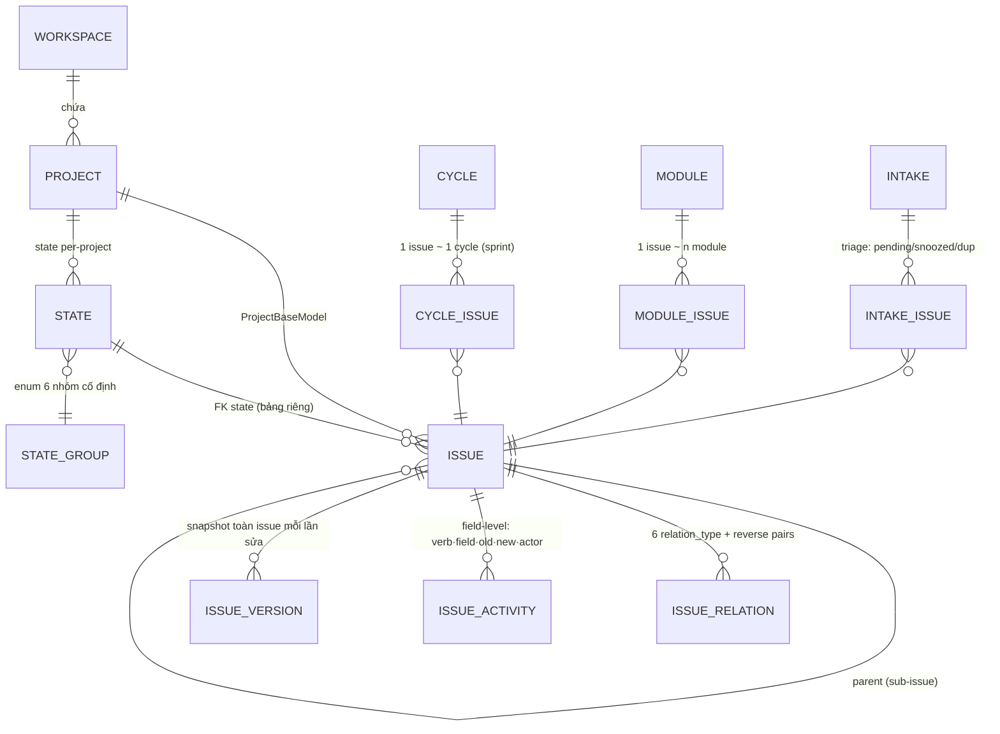

# 08 · Plane — Work Management (trace nhẹ)

> WTM-452 (Epic WTM-447) · 2026-08-25 · SHA `1d0ee24` branch `preview` ·
> **AGPL-3.0 ⇒ LEARN ONLY, ⛔ cấm chép code**. Độ sâu NHẸ theo chỉ đạo Founder:
> đủ trả lời câu quyết định, không đào ngang. So sánh với Jira/AI-WF ở `09`.

## 1. Issue model — bảng nào, quan hệ gì

Nguồn: `apps/api/plane/db/models/issue.py` (822 dòng) + `state.py`.

- **`Issue(ChangeTrackerMixin, ProjectBaseModel)`** — mọi row tự mang `workspace`+`project`
  FK (ProjectBaseModel). `TRACKED_FIELDS = ["state_id"]`: đổi state được mixin bắt ngay
  trong model, `_sync_completed_at()` tự set/clear `completed_at` khi state đổi nhóm.
- **State là BẢNG RIÊNG per-project, không phải enum** (`state.py::State`), nhưng mỗi state
  bắt buộc thuộc một **`StateGroup` enum cố định 6 giá trị**: `backlog · unstarted · started ·
  completed · cancelled · triage`. Người dùng tự do đặt workflow, hệ thống vẫn tính được
  "xong hay chưa" qua group — **hai tầng: tự do hiển thị / cố định ngữ nghĩa**.
- **Priority là enum trên Issue** (`urgent/high/medium/low/none`) — không phải bảng.
- **Sub-issue = `parent` self-FK**. Không có bảng Epic riêng — phân cấp là quan hệ, không phải type.
- **Relation/blocker**: `IssueRelation` (issue · related_issue · `relation_type`) với choices
  `duplicate · relates_to · blocked_by · start_before · finish_before · implemented_by` +
  bảng `_RELATION_PAIRS` sinh chiều ngược (`blocked_by`↔`blocking`). `IssueBlocker` là bảng
  cũ còn sống song song.
- **`sequence_id` per-project** cấp bằng `pg_advisory_xact_lock` theo project id
  (`Issue.save()`, dòng 189–214) — số WTM-xx kiểu Jira, chống trùng khi ghi song song;
  `IssueSequence` giữ số kể cả khi issue bị xoá.
- **`external_source` + `external_id` có mặt trên hầu hết bảng** (Issue, State, Comment,
  Attachment, Cycle, Module…) — provenance import là trường chuẩn, không phải afterthought.
  Cùng họ với doctrine provenance của WTM-238.
- Description lưu **4 dạng song song**: `description_json/html/stripped/binary` (binary = CRDT
  cho realtime editor `apps/live`).
- Vệ tinh: `IssueAssignee`/`IssueLabel` (M2M through), `IssueLink`, `IssueAttachment`,
  `IssueSubscriber`, `IssueMention`, `IssueReaction`, `IssueVote`, `IssueComment`
  (threaded qua `parent`, `access = INTERNAL/EXTERNAL`, "System can also create comment").
- Default manager **ẩn sẵn** triage/archived/draft (`IssueManager.get_queryset()`).

## 2. Cycle · Module · Project

- **Cycle** (`cycle.py`) = sprint: start/end datetime + timezone riêng, `progress_snapshot`
  JSON (đóng băng số liệu khi cycle kết thúc). `CycleIssue` unique (issue, cycle);
  `IssueVersion.log_issue_version` lấy `.first()` ⇒ thực tế **1 issue ~ 1 cycle**.
- **Module** (`module.py`) = nhóm theo feature: có `status` enum riêng
  (backlog→planned→in-progress→paused→completed→cancelled), `lead` + `members`.
  1 issue thuộc **nhiều** module. Cycle = thời gian, Module = phạm vi — hai trục độc lập,
  không nhét chung vào một khái niệm "sprint".
- **Per-user view props**: `CycleUserProperties` (và họ hàng) lưu `filters/display_filters/
  display_properties` JSON **per user per container** — cách nhìn là dữ liệu cá nhân,
  không phải config chung.

## 3. Activity / history — HAI tầng granularity

Nguồn: `issue.py::IssueActivity` (dòng 415) + `IssueVersion` (677) + `IssueDescriptionVersion` (782).

| Tầng | Bảng | Ghi gì |
|---|---|---|
| Field-level | `IssueActivity` | `verb · field · old_value · new_value · actor · old/new_identifier · epoch` — một dòng mỗi field đổi |
| Snapshot | `IssueVersion` | chụp **toàn bộ** issue (state, assignees[], labels[], cycle, modules[]…) mỗi lần sửa, FK về `activity` gây ra nó |
| Nội dung | `IssueDescriptionVersion` | riêng cho description (nặng, đổi nhiều) |

Activity trả lời *"ai đổi gì"*, Version trả lời *"lúc đó issue trông thế nào"* — hai câu hỏi
khác nhau, hai bảng. `.ttbk`/audit của Tổng Tài mới có tầng 1 (P-31 họ hàng: đường ghi
không chụp trạng thái).

## 4. API cho automation

Nguồn: `apps/api/plane/api/` (external API, tách khỏi `plane/app/` cho web client).

- **REST thuần (DRF), không GraphQL.** Auth = `APIKeyAuthentication` header, token model
  `api.py::APIToken` có **`user_type` Human/Bot (0/1) · `is_service` · `allowed_rate_limit`
  per-token** (mặc định `60/min`, `settings/common.py::API_KEY_RATE_LIMIT`).
- **OpenAPI tự mô tả**: `urls/schema.py` — drf-spectacular + Swagger UI + Redoc.
- **Cursor pagination** `?cursor=limit:offset:is_prev&per_page=` — `utils/paginator.py::
  get_per_page` default/max **1000** ở tầng base (endpoint có thể siết lại).
- **Webhook có thật ở DB**: `webhook.py::Webhook` per-workspace, bật/tắt theo entity
  (project·issue·module·cycle·comment), `secret_key` HMAC, `WebhookLog` lưu request/response
  + `retry_count`.
- Naming đang đổi `issues → work-items` (urls giữ cả hai — `urls/work_item.py`).
- Search: `GET workspaces/<slug>/work-items/search/`.

## 5. UX pattern đáng học (đọc cấu trúc `apps/web/core/components/`)

1. **`power-k/`** — command palette (Cmd-K) là **module đầy đủ**: `actions/ · config/ ·
   global-shortcuts.tsx · menus/` — mọi thao tác đi qua một cửa, không phải widget trang trí.
2. **`inbox/` + model `Intake`** (`intake.py`) — hàng đợi triage đúng nghĩa:
   `IntakeIssueStatus = PENDING(-2) · REJECTED(-1) · SNOOZED(0) · ACCEPTED(1) · DUPLICATE(2)`,
   kèm `snoozed_till`, `duplicate_to` FK, `source_email` (tạo issue qua email). Issue vào hệ
   qua cổng duyệt, không rơi thẳng vào backlog.
3. **`views/` + model `IssueView`** (`view.py`) — saved view = **dữ liệu** (`query` + `filters`
   + `display_filters` JSON), không phải code; một bộ filter render ra list/kanban/calendar/
   gantt (`gantt-chart/`, `rich-filters/`).
4. **State-group hai tầng** (§1) — workflow tuỳ biến nhưng ngữ nghĩa cố định.

Ánh xạ về Tổng Tài + verdict 5 trục: xem `09-PLANE-VS-JIRA-AIWF.md`.
