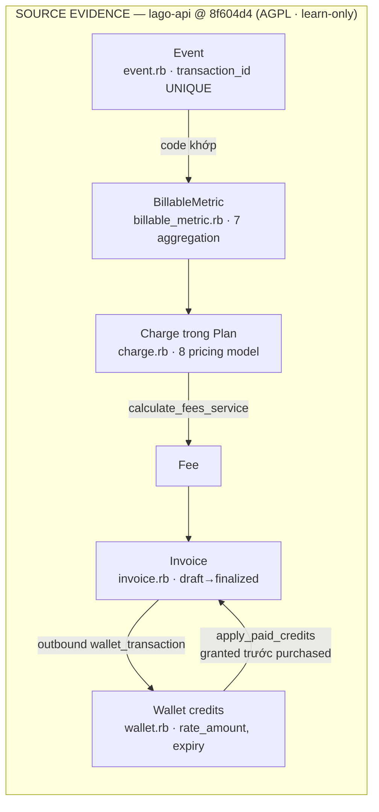

# 10 · Lago Billing — domain model metering → invoice → wallet

> WTM-452 (Epic WTM-447) · 2026-08-25 · Độ sâu **NHẸ** · Source: `_reference/lago-api`
> SHA `8f604d4` — **AGPL-3.0 ⇒ LEARN ONLY, cấm chép code** (License Gate ở `01-SOURCE-BASELINE.md`).
> Trace theo FILE → SYMBOL → CONCLUSION; chọn model tiêu biểu, không quét cả 105 model.

## 1. Usage event ingestion — idempotency là UNIQUE INDEX, không phải code

| FILE | SYMBOL | CONCLUSION |
|---|---|---|
| `app/models/event.rb` | schema `events` | Event = `code` (trỏ metric) + `transaction_id` + `external_subscription_id` + `properties` (jsonb) + `timestamp`. Không FK cứng tới customer/subscription — resolve **lazy** qua `external_*` id (method `customer`, `subscription` tự query theo timestamp). |
| `app/models/event.rb` | `index_unique_transaction_id` | Idempotency = UNIQUE `(organization_id, external_subscription_id, transaction_id)` **ở tầng DB**. Client retry gửi trùng ⇒ DB từ chối, không cần dedup logic. |
| `app/services/events/create_service.rb` | `rescue ActiveRecord::RecordNotUnique` | Trùng `transaction_id` trả lỗi validation `value_already_exist` — API báo rõ cho client, không silently drop. |
| `app/services/events/create_service.rb` | `event.save! unless organization.clickhouse_events_store?` + `produce_kafka_event` | Hai đường ghi: mặc định **Postgres**; org volume lớn bật **ClickHouse** (models `clickhouse/events_raw.rb`, `events_enriched.rb`, `events_dead_letter.rb`) và event đi qua **Kafka**. High-volume là **opt-in per-org**, không phải kiến trúc bắt buộc. |

## 2. BillableMetric — 7 kiểu aggregation

`app/models/billable_metric.rb` — `AGGREGATION_TYPES`: `count` · `sum` · `max` ·
`unique_count` · `weighted_sum` (theo **giây**, cho tài nguyên chiếm giữ theo thời gian) ·
`latest` · `custom` (aggregator tự viết). Metric = `code` (khớp `event.code`) +
`field_name` (trỏ vào key trong `event.properties` — `count` không cần field) + cờ
`recurring` + `expression` (biến đổi property trước khi aggregate). `count/sum/unique_count/custom`
được phép **pay-in-advance** (`AGGREGATION_TYPES_PAYABLE_IN_ADVANCE`).

## 3. Plan / Charge — pricing model tách khỏi metric

| FILE | SYMBOL | CONCLUSION |
|---|---|---|
| `app/models/plan.rb` | `INTERVALS`, `pay_in_advance` | Plan = giá cố định theo kỳ (weekly→semiannual) + trial; `pay_in_arrears` là mặc định nghịch đảo. |
| `app/models/charge.rb` | `CHARGE_MODELS` | 8 pricing model: `standard` (đơn giá) · `graduated` (bậc thang) · `package` (gói N đơn vị) · `percentage` (% trên amount) · `volume` · `graduated_percentage` · `custom` · `dynamic`. Charge = **cầu nối Plan↔BillableMetric**, cấu hình giá nằm trong `properties` jsonb — đổi giá không đổi schema. |
| `app/models/charge.rb` | validate `validate_pay_in_advance`, `validate_prorated` | Ma trận hợp lệ (aggregation × charge model × pay_in_advance × prorated) enforce **ở model**, không để UI tự do phối. |

## 4. Wallet / prepaid credits — ⭐ map thẳng "project credits" AI Teams

| FILE | SYMBOL | CONCLUSION |
|---|---|---|
| `app/models/wallet.rb` | `rate_amount`, `credits_balance` + `balance_cents` | Wallet giữ **hai đơn vị song song**: credits và tiền; `rate_amount` = tỷ giá credit→tiền cố định per wallet. Khách nhìn credits, sổ vẫn ra tiền. |
| `app/models/wallet.rb` | `ongoing_balance_cents`, `depleted_ongoing_balance` | Ngoài balance đã chốt còn **ongoing balance** = balance trừ usage-chưa-ra-invoice (refresh bởi `services/wallets/balance/refresh_ongoing_usage_service.rb`) — là **ước lượng hiển thị**, KHÔNG phải hold/escrow. |
| `app/models/wallet.rb` | `expiration_at`, `priority`, `limited_to_billable_metrics?`, `allowed_fee_types` | Credits có hạn dùng; nhiều wallet/khách tiêu theo `priority`; wallet có thể **giới hạn theo metric/fee type** (credits chỉ tiêu được cho món X). |
| `app/models/wallet_transaction.rb` | `TRANSACTION_TYPES` inbound/outbound · `TRANSACTION_STATUSES` `purchased/granted/voided/invoiced` · `SOURCES` `manual/interval/threshold` | Nạp = inbound (mua thật vs **granted** = tặng); trừ = outbound gắn `invoice_id`. Auto top-up 2 kiểu: định kỳ (`interval`) và **khi cạn** (`threshold`, `services/wallets/threshold_top_up_service.rb`). |
| `app/models/wallet_transaction.rb` | `in_consumption_order`, `remaining_amount_cents`, `WalletTransactionConsumption` | Tiêu credits theo thứ tự **granted trước purchased**, FIFO trong mỗi loại; mỗi lần tiêu ghi link consumption inbound↔outbound ⇒ truy được "credit nào bị tiêu bởi invoice nào". |
| `app/services/wallets/balance/` | `increase/decrease_service` | Mọi biến động balance đi qua service tập trung, không update tự do. |

## 5. Subscription + Invoice — usage chốt lúc invoice ra khỏi `draft`

- `subscription.rb`: status `pending/active/terminated/canceled/incomplete`; `billing_time`
  `calendar` vs `anniversary` (mốc chốt kỳ).
- `invoice.rb`: máy trạng thái AASM `draft → finalized → voided`; types gồm `subscription` ·
  `advance_charges` · `progressive_billing` (vượt usage threshold giữa kỳ) · `credit` (mua
  credits cũng ra invoice). Scope `ready_to_be_finalized` = draft đến hạn `issuing_date`.
- Vòng chốt: hết kỳ → `services/invoices/calculate_fees_service.rb` aggregate event theo
  từng charge thành **Fee** → invoice `draft` (còn refresh được) → **finalize** = chốt số,
  đánh số invoice, không sửa nữa. Credits wallet apply vào invoice ở bước tính tổng.
- Pay-in-advance charge tạo fee **ngay khi event đến** (`services/events/pay_in_advance_service.rb`,
  `invoices/create_pay_in_advance_charge_service.rb`) — không đợi cuối kỳ.

## 6. Self-host footprint (repo vỏ `_reference/lago` · `docker-compose.yml`)

Service bắt buộc: **db** (postgres-partman) · **redis** · **migrate** (one-shot) · **api** ·
**front** · **api-worker** (Sidekiq) · **api-clock** (cron chốt kỳ) · **pdf** (render invoice)
⇒ **8 container, 7 chạy thường trực**. `api-events-worker` bị comment (bật khi volume lớn);
Kafka + ClickHouse **không có** trong compose mặc định — đúng với kết luận §1: high-volume là opt-in.
Tức self-host tối thiểu vẫn là một hệ Rails đầy đủ: 2 datastore + 5 process.

## 7. Bài học domain (mang đi được, không mang code)

1. **Idempotency đặt ở DB constraint**, API trả lỗi rõ — không dedup bằng logic.
2. **Meter (aggregation) tách khỏi pricing (charge model)** — đổi giá không chạm metering.
3. Wallet hai đơn vị + `rate_amount`; **granted ≠ purchased** và tiêu granted trước.
4. **Ongoing balance là ước lượng**, không phải escrow — Lago KHÔNG có reserve/hold per job.
5. Usage chỉ thành tiền ở **Fee**, chỉ chốt ở **finalize** — trước đó mọi số là draft.
