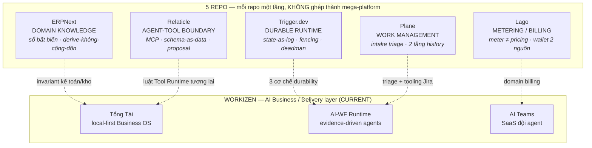
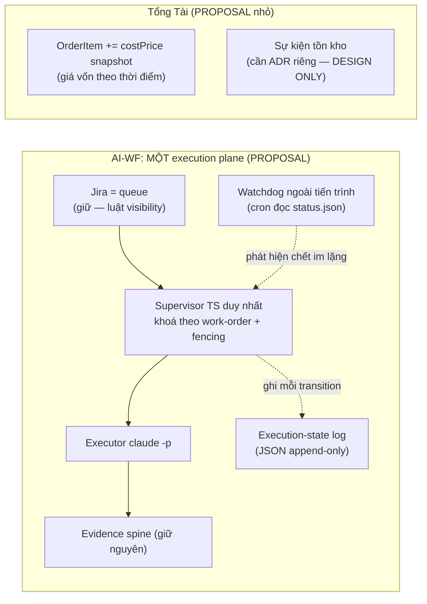

# 12 · Cross-Repo Architecture — năm repo, năm tầng, và chỗ Workizen đứng

> WTM-453 (Epic WTM-447) · 2026-08-25 · Tổng hợp từ 02–11. Mỗi khẳng định về
> một repo đều đã có evidence FILE→SYMBOL trong file study tương ứng — file này
> không lặp lại evidence, chỉ ghép hình.

## 1. Bản đồ — mỗi repo trả lời MỘT câu hỏi

Điều bản đồ này nói: **không repo nào cùng tầng với Workizen.** ERPNext là hệ
ghi sổ; Relaticle là CRM có cửa cho agent; Trigger.dev là hạ tầng chạy job;
Plane là bảng việc; Lago là máy tính tiền. Workizen là **tầng ra quyết định
kinh doanh bằng AI trên dữ liệu của chính người bán** — tầng đó không repo nào
trong năm cái làm. Vì thế mọi verdict đều dừng ở LEARN/ADAPT: không có gì để
"thay thế", chỉ có invariant để học.

## 2. Ba xác nhận độc lập cho kiến trúc hiện tại

Ba quyết định Workizen từng chọn bằng lý lẽ, nay có code của người khác làm chứng:

| Quyết định Workizen | Ai xác nhận | Bằng cách nào |
|---|---|---|
| **Cửa ghi duy nhất** (BusinessAction, WTM-300) | Relaticle — bằng **phản ví dụ** | Họ có HAI kỷ luật ghi: MCP ghi thẳng không duyệt, Chat qua proposal. Đúng hình dạng lỗi WTM-300 tồn tại để chặn |
| **Derive, không cộng dồn** (WTM-297) | ERPNext — bằng **đồng dạng** | `per_received`/`per_billed`/`outstanding_amount` đều recompute từ sổ bằng SQL SUM; không counter nào tự cộng |
| **Catalog là dữ liệu, AI chỉ hứa cột verified** (ADR-TON-024 §3) | Relaticle — bằng **đồng dạng** | Schema resource per-team sinh từ DB, tool bị ép "MUST read schema first", code lạ reject |

## 3. Ba lỗ hổng chỉ lộ khi đặt cạnh code người khác

1. **`products.totalStock` là số mutable không có sự kiện nguồn** — miền duy
   nhất của Tổng Tài chưa theo kỷ luật "số có chủ + dựng lại được". Orders
   không trừ kho; tổng variant không ràng buộc tổng cha. (ERPNext: mọi thay
   đổi tồn là một `Stock Ledger Entry` bất biến.)
2. **AI-WF: hai khoá ở hai plane không thấy nhau** — bash `mkdir`-lock và TS
   pid-lock độc lập; một supervisor bash + một run TS có thể cùng cầm một
   project. (Trigger.dev: không lock nào cả — fencing bằng `snapshotId` trên
   từng lệnh.)
3. **Crash giữa attempt vô hình từ Jira** — AI-WF không có execution-state
   log; `claude -p` bị kill để lại đúng những gì đã commit vào git, không dấu
   vết trạng thái. (Trigger.dev: snapshot append-only, RECONCILE là phép đọc.)

## 4. Hình đích đề xuất — PROPOSAL, chờ Founder

Ranh giới của đề xuất: **không migrate sang framework nào** — ba cơ chế trên
xây bằng file JSON + một dòng cron; phần Workizen-specific (evidence judge ·
Jira-queue · device preflight · safe-git) giữ nguyên vì không repo nào có.
